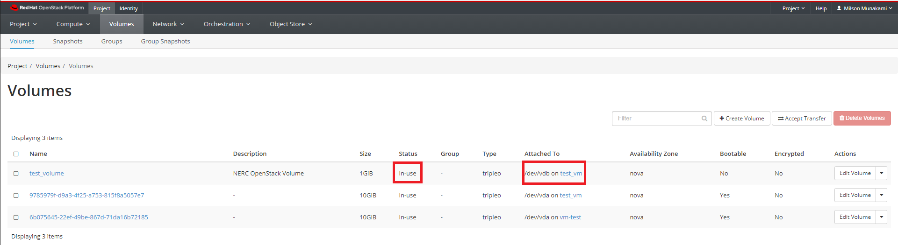

# Persistent Storage

## Volumes

A volume is a detachable block storage device, similar to a USB hard drive. You can attach a volume to only one instance.

Volumes are the Block Storage devices that you attach to instances to enable persistent storage. Users can attach a volume to a running instance or detach a volume and attach it to another instance at any time.

Ownership of volumes can be transferred to another project.

Some uses for volumes:

- Persistent data storage for ephemeral instances.
- Transfer of data between projects
- Bootable image where disk changes persist
- Mounting the disk of one instance to another for troubleshooting

Navigate to Project -> Volumes -> Volumes.


### Create an empty volume

An empty volume is like an unformatted USB stick.  We'll attach it to an instance, create a filesystem on it, and mount it to the instance.

Click "Create Volume".

In the Create Volume dialog box, give your volume a name.  The description field is optional.

Choose "empty volume" from the Source dropdown.  This will create a volume that is like an unformatted hard disk.  Choose a size (In GiB) for your volume. Leave Type and Availibility Zone as it as. Only admin to the NERC OpenStack will be able to manage volume types.

Click "Create Volume" button.


In a few moments, the newly created volume will appear in the Volumes list with the Status "Available".


### Attach the volume to an instance

In the Actions column, click the dropdown and select "Manage Attachments".


From the  menu, choose the instance you want to connect the volume to from Attach to Instance, and click "Attach Volume".


The volume now has a status of "In Use" and the Attached To column shows which instance it is attached to, and what device name it has.

This will be something like `/dev/vdb` but it can vary depending on the state of your instance, and whether you have attached volumes before.

Make note of the device name of your volume.



### Format and mount the volume

SSH to your instance.  You should now see the volume as an additional disk in the output of `sudo fdisk -l` or `lsblk`.

```sh
  # lsblk
  NAME    MAJ:MIN RM  SIZE RO TYPE MOUNTPOINT
  ...
  vda     254:0    0   10G  0 disk
  ├─vda1  254:1    0  9.9G  0 part /
  ├─vda14 254:14   0    4M  0 part
  └─vda15 254:15   0  106M  0 part /boot/efi
  vdb     254:16   0    1G  0 disk
```

We see the volume here as the disk 'vdb', which matches the `/dev/vdb/` we noted in the Attached To column.

In this case it's easy to spot because there is only one additional disk attached to the instance, but it's important to keep track of the device name, especially if you have multiple volumes attached.

Also, a given volume might not get the same device name the second time you attach it to an instance.

Create a filesystem on the volume and mount it - in the example we create an `ext4` filesystem:

```sh
  # mkfs.ext4 /dev/vdb
  # mkdir /mnt/test_volume
  # mount /dev/vdb /mnt/test_volume
```

The volume is now available at the mount point:

```sh
  # lsblk
  NAME    MAJ:MIN RM  SIZE RO TYPE MOUNTPOINT
  ...
  vda     254:0    0   10G  0 disk
  ├─vda1  254:1    0  9.9G  0 part /
  ├─vda14 254:14   0    4M  0 part
  └─vda15 254:15   0  106M  0 part /boot/efi
  vdb     254:16   0    1G  0 disk /mnt/test_volume
```

If you place data in the directory `/mnt/test_volume`, detach the volume, and mount it to another instance, the second instance will have access to the data.

### Detach a volume

To detach a mounted volume by going back to Manage Attachments and choosing Detach Volume.

Once it is successfully detached, you can use Manage Attachments to attach it to another instance if desired.

### Delete volumes

When you delete an instance, the data of its attached volumes is not destroyed.

Navigate to Project -> Volumes -> Volumes.

Select the volume or volumes that you want to delete.

Click "Delete Volumes" button.

In the Confirm Delete Volumes window, click the Delete Volumes button to confirm the action.

### Create Volume from Image

You can create a volume from an existing image.  If the image is bootable, you can use the volume to launch an instance.

Click "Create Volume".

This time, in the Create Volume dialog box, for Volume Source, choose 'Image'.  From the 'Use Image as a Source' dropdown, choose the image you'd like to use.

To use this volume to launch an instance, you can choose Boot From Volume in the Instance "Select Boot Source" dropdown when creating an instance, then select your volume from the Volumes list.

Make sure 'Delete Volume on Instance Delete' is selected "No" if you want the volume to persist even after the instance is terminated.

!!! note "Note"
    Only one instance at a time can be booted from a given volume.

---
