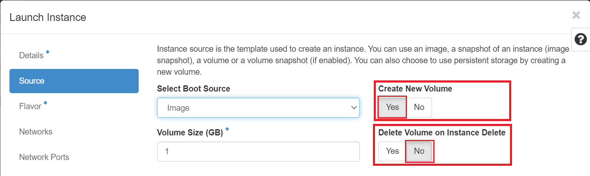

# Persistent Storage

## Ephemeral disk

OpenStack offers two types of block storage: ephemeral storage and persistent volumes.
Ephemeral storage is available only during the instance's lifespan, persisting
across guest operating system reboots. However, once the instance is deleted,
its associated storage is also removed. The size of ephemeral storage is determined
by the virtual machine's flavor and remains constant for all virtual machines of
that flavor. The service level for ephemeral storage relies on the underlying hardware.

In its default configuration, when the instance is launched from an **Image** or
an **Instance Snapshot**, the choice for utilizing persistent storage is configured
by selecting the **Yes** option for "Create New Volume". Additionally, the "Delete
Volume on Instance Delete" setting is pre-set to **No** as shown below:

If you set the **"Create New Volume"** option to **No**, the instance will boot
from either an image or a snapshot, with the instance only being attached to an
ephemeral disk. It's crucial to note that this configuration does **NOT** create
persistent block storage in the form of a Volume, which can pose risks. Consequently,
the disk of the instance won't appear in the "Volumes" list. To mitigate potential
data loss, we strongly recommend regularly [taking a snapshot](../backup/backup-with-snapshots.md#create-and-use-instance-snapshots)
of such a running ephemeral instance, referred to as an **"instance snapshot"**,
especially if you want to safeguard or recover important states of your instance.

## Volumes

A volume is a detachable block storage device, similar to a USB hard drive. You
can attach a volume to only one instance.

Unlike Ephemeral disk, Volumes are the Block Storage devices that you attach to
instances to enable persistent storage. Users can attach a volume to a running
instance or detach a volume and attach it to another instance at any time.

Ownership of volumes can be transferred to another project by transferring it to
another project as [described here](../persistent-storage/transfer-a-volume.md).

Some uses for volumes:

- Persistent data storage for ephemeral instances.
- Transfer of data between projects
- Bootable image where disk changes persist
- Mounting the disk of one instance to another for troubleshooting

## How do you make your VM setup and data persistent?

- By default, when the instance is launched from an **Image** or an
**Instance Snapshot**, the choice for utilizing persistent storage is configured
by selecting the **Yes** option for **"Create New Volume"**. It's crucial to
note that this configuration automatically creates persistent block storage
in the form of a Volume instead of using Ephemeral disk, which appears in
the "Volumes" list in the Horizon dashboard: *Project -> Volumes -> Volumes*.

    

- By default, the setting for **"Delete Volume on Instance Delete"** is configured
to use **No**. This setting ensures that the volume created during the launch
of a virtual machine remains persistent and won't be deleted alongside the
instance unless explicitly chosen as "Yes". Such instances boot from a
**bootable volume**, utilizing an existing volume listed in the
*Project -> Volumes -> Volumes* menu.

To minimize the risk of potential data loss, we highly recommend consistently
[creating backups through snapshots](../backup/backup-with-snapshots.md).
You can opt for a **"volume snapshot"** if you only need to capture the volume's
data. However, if your VM involves extended running processes and vital
in-memory data, preserving the precise VM state is essential. In such cases,
we recommend regularly taking a snapshot of the entire instance, known as an
**"instance snapshot"**, provided you have sufficient **Storage quotas**,
specifically the "OpenStack Volume Quota", "OpenStack Volume GB Quota", and
"OpenStack Swift Quota in Gigabytes" allocated for [your resource allocation](../../get-started/allocation/allocation-details.md#general-user-view-of-openstack-resource-allocation).
Utilizing snapshots for backups is of utmost importance, particularly when
safeguarding or recovering critical states and data from your instance.

!!! danger "Very Important: Requested/Approved Allocated Storage Quota and Cost"
    When you [delete virtual machines](../decommission/decommission-openstack-resources.md#delete-all-vms)
    backed by persistent volumes, the disk data is retained, continuing to consume
    approved storage resources for which you will still be billed. It's important
    to note that the **Storage quotas**, specifically the "OpenStack Volume GB
    Quota" and "OpenStack Swift Quota in Gigabytes", determine the cost based on
    [your approved and reserved storage allocation](../../get-started/allocation/allocation-details.md#general-user-view-of-openstack-resource-allocation),
    which reserves storage from the total NESE storage pool.

    If you request additional storage by specifying a changed quota value for
    the "OpenStack Volume GB Quota" and "OpenStack Swift Quota in Gigabytes"
    attribute through [NERC's ColdFront interface](https://coldfront.mss.mghpcc.org/),
    invoicing for the extra storage will take place upon fulfillment or approval
    of your request, as explained in our
    [Billing FAQs](../../get-started/cost-billing/billing-faqs.md).

    Conversely, if you request a reduction in the **Storage quotas**, specifically
    the "OpenStack Volume GB Quota" and "OpenStack Swift Quota in Gigabytes", through
    a [change request using ColdFront](../../get-started/allocation/allocation-change-request.md#request-change-resource-allocation-attributes-for-openstack-project),
    your invoicing will be adjusted accordingly when the request is approved or
    processed. In both scenarios, 'invoicing' refers to the accumulation of hours
    corresponding to the added or removed storage quantity.

!!! question "Help Regarding Billing"
    Please send your questions or concerns regarding Storage and Cost by emailing
    us at [help@nerc.mghpcc.org](mailto:help@nerc.mghpcc.org?subject=NERC%20Billing%20Question)
    or, by submitting a new ticket at [the NERC's Support Ticketing System](https://mghpcc.supportsystem.com/open.php).

---
