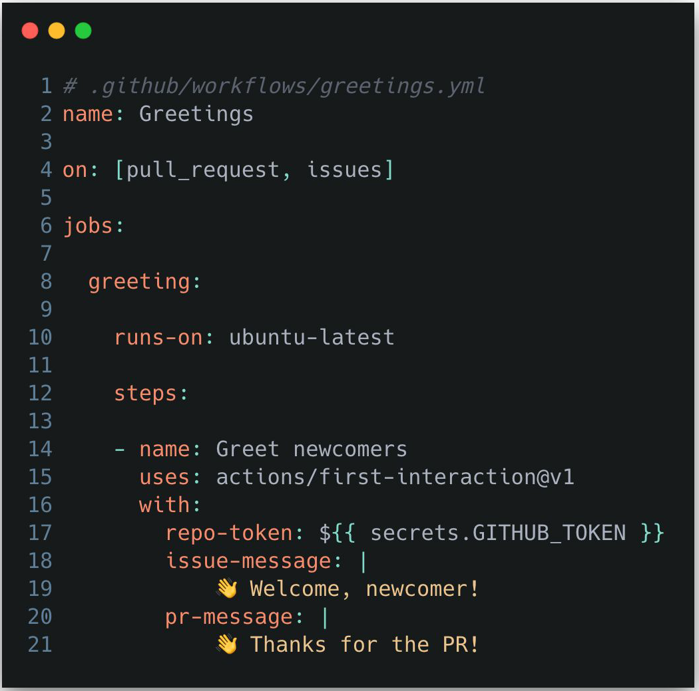
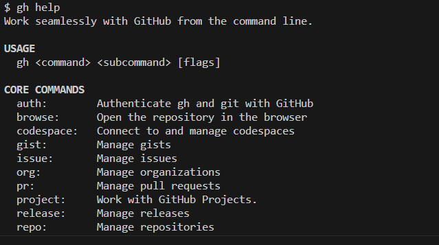
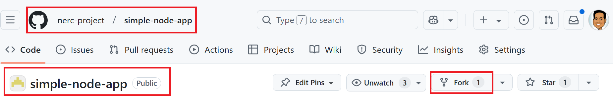
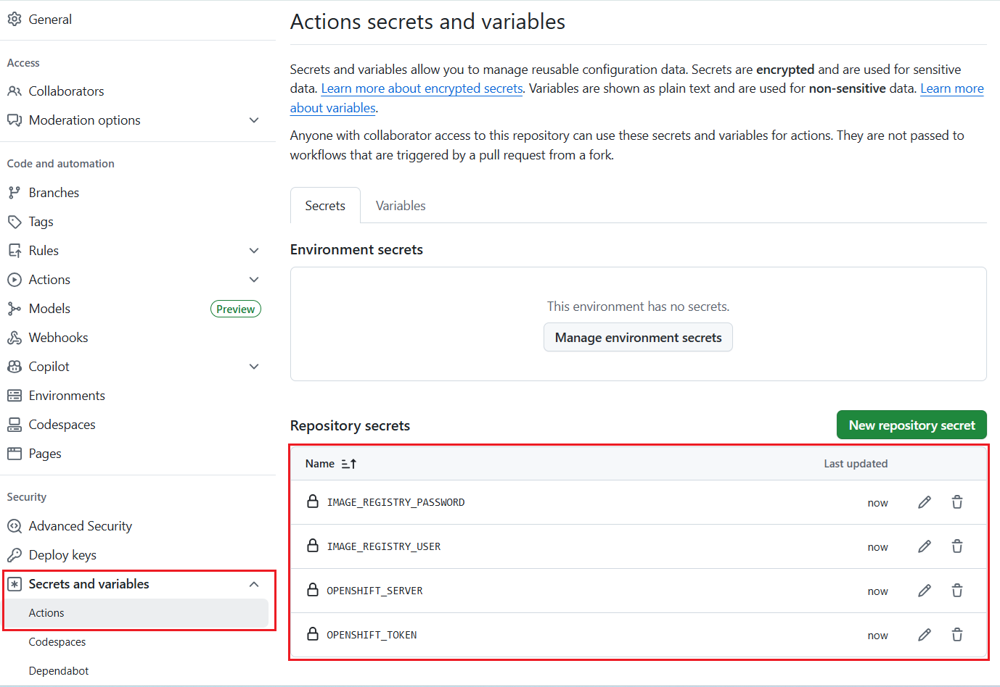
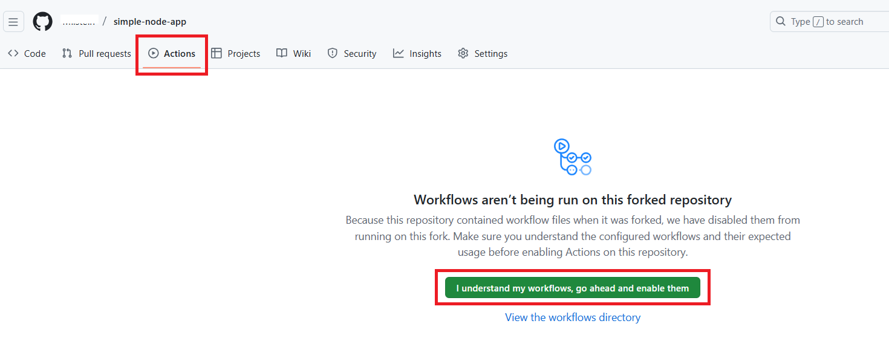
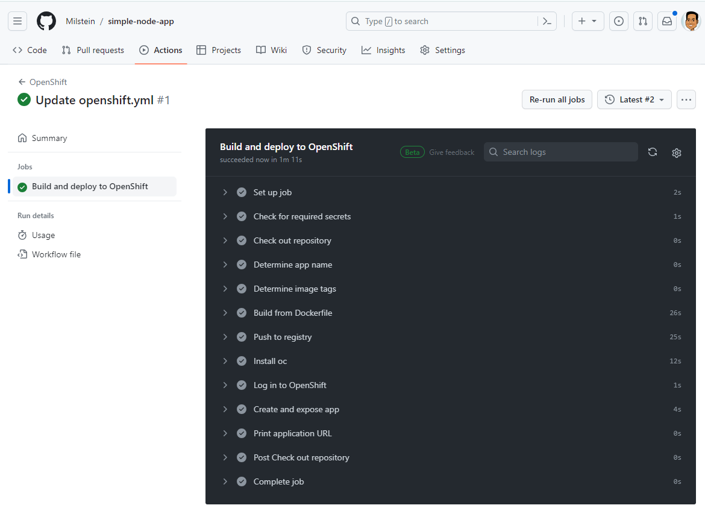
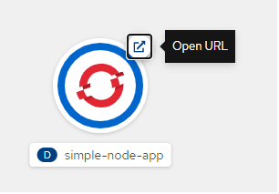
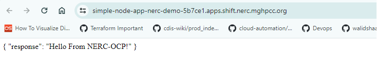
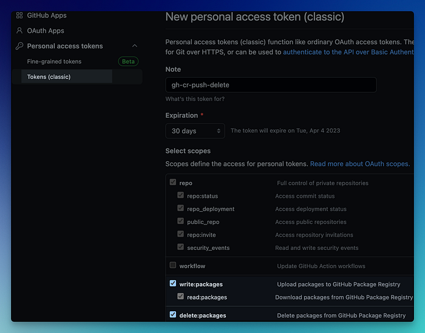

# How to setup GitHub Actions Pipeline

[GitHub Actions](https://github.com/features/actions) gives you the ability to
create workflows to automate the deployment process to OpenShift. GitHub Actions
makes it easy to automate all your CI/CD workflows.

## Terminiology



### Workflow

Automation-as-code that you can set up in your repository.

### Events

30+ workflow triggers, including on schedule and from external systems.

### Actions

Community-powered units of work that you can use as steps to create a job in a
workflow.

## Deploy an Application to your NERC OpenShift Project

-   **Prerequisites**:

    You must have at least one active **NERC-OCP (OpenShift)** type resource allocation.
    You can refer to [this documentation](../../../get-started/allocation/requesting-an-allocation.md#request-a-new-openshift-resource-allocation-for-an-openshift-project)
    on how to get allocation and request "NERC-OCP (OpenShift)" type resource allocations.

### Steps

#### 1. Access NERC OpenShift Web Console

Access to the NERC's OpenShift Container Platform at [https://console.apps.shift.nerc.mghpcc.org](https://console.apps.shift.nerc.mghpcc.org)
as [described here](../../../openshift/logging-in/access-the-openshift-web-console.md).
To get access to NERC's OCP web console you need to be part of ColdFront's active
allocation.

#### 2. Install and Configure OpenShift CLI (`oc`)

Setup the OpenShift CLI (`oc`) Tools locally and configure the OpenShift CLI to
enable `oc` commands. Refer to [this user guide](../../../openshift/logging-in/setup-the-openshift-cli.md).

#### 3. Install and Verify GitHub CLI (`gh`)

Setup Github CLI on your local machine as [described here](https://docs.github.com/en/github-cli/github-cli/quickstart)
and verify you are able to run `gh` commands as shown below:



#### 4. Fork the `simple-node-app` App in your own Github account  

This application `simple-node-app` runs a simple `node.js` server and serves up
some static routes with some static responses. This demo shows a simple container
based app can easily be bootstrapped onto your NERC OpenShift project space.

!!! warning "Very Important Information"

    As you won't have full access to [this repository](https://github.com/nerc-project/simple-node-app/),
    we recommend first forking the repository on your own GitHub account. So,
    you'll need to update all references to `https://github.com/nerc-project/simple-node-app.git`
    to point to your own forked repository.

To create a fork of the example `simple-node-app` repository:

-   Go to [https://github.com/nerc-project/simple-node-app](https://github.com/nerc-project/simple-node-app).

-   Click the "Fork" button to create a fork in your own GitHub account, e.g.
    "`https://github.com/<github_username>/simple-node-app`".

    

    !!! tip "Unselect Copy the `main` branch only Option"

        When forking the repository, make sure to **unselect the "Copy the `main`
        branch only" option**. If this option is left enabled (**selected by default**),
        only the default `main` branch will be copied, and other branches - such
        as `with_pvc`, which contains important CI/CD workflows for using a
        **Persistent Volume Claim (PVC)** - will not be included.

        

        Unselecting this option ensures that **all branches are copied**, preserving
        the complete repository history and structure needed for proper development
        and deployment. This is especially important if you plan to follow the
        optional PVC setup described in [Step 5](#5-clone-your-forked-simple-node-app-repo-optional-pvc-setup).

#### 5. Clone Your Forked `simple-node-app` Repo (Optional PVC Setup)

Clone your forked _simple-node-app_ git repository:

```sh
git clone <https://github.com/><github_username>/simple-node-app.git
cd simple-node-app
```

!!! tip "Very Important: Using PVC in the Application"

    If you want to attach a **Persistent Volume Claim (PVC)** to the container,
    use the `with_pvc` branch.

    You can switch to the `with_pvc` branch:

    ```sh
    git checkout with_pvc
    ```

    This branch includes the necessary
    **[GitHub Actions workflow file](https://github.com/<github_username>/simple-node-app/blob/with_pvc/.github/workflows/openshift.yml)**
    for mounting a PVC inside the container so that data can be
    **persisted across pod restarts and container rebuilds**.

    The PVC behavior can be customized through the following environment variables
    in the workflow. These values can be adjusted based on your application's requirements:

    ```yaml
    # === PVC SETTINGS ===
    # 🖊️ Requested size of the PVC
    PVC_SIZE: "1Gi"

    # 🖊️ StorageClass name (leave empty to use the cluster default StorageClass)
    PVC_STORAGE_CLASS: ""

    # 🖊️ Path inside the container where the PVC will be mounted
    PVC_MOUNT_PATH: "/srv/data"
    ```

#### 6. Run Secret Setup Script and Verify GitHub Secrets

Run either the `setsecret.cmd` file if you are using Windows or the `setsecret.sh`
file if you are on a Linux-based machine. Once executed, verify that the GitHub
Secrets are set properly under your repository's
_settings >> secrets and variables >> Actions_ as shown here:



!!! note "Important Note"

    If you are using the **GitHub Container Registry (GHCR)**, you do **not**
    need to set other registry-related secrets, such as `IMAGE_REGISTRY_USER`
    and `MY_REGISTRY_PASSWORD`, as they are obtained directly from your repository.

    These two additional secrets are required only if you plan to use **Quay.io**
    or **Dockerhub** registries.

#### 7. Enable and Configure GitHub Actions OpenShift Workflow

Enable and Update GitHub Actions Pipeline on your own forked repo:

-   Enable the OpenShift Workflow in the Actions tab of in your GitHub repository.

    

-   Update the provided sample OpenShift workflow YAML file i.e. `openshift.yml`,
     which is located at "`https://github.com/<github_username>/simple-node-app/actions/workflows/openshift.yml`".

    !!! info "Very Important Information"

        Workflow execution on OpenShift pipelines follows these steps:

        1. Checkout your repository

        2. Perform a container image build

        3. Push the built image to the GitHub Container Registry (GHCR) or your
        preferred Registry

        4. Log in to your NERC OpenShift cluster's project space

        5. Create an OpenShift app from the image and expose it to the internet

#### 8. Edit `env` Configuration in `openshift.yml`

Edit the top-level `env` section as marked with '🖊️' in the `openshift.yml`
file if the default values are not suitable for your project.  

!!! warning "Very Important Note"

    In the provided sample OpenShift workflow YAML file (`openshift.yml`),
    uncomment the lines for your chosen registry: `GitHub Container Registry
    (GHCR)`, `quay.io`, or `docker.io`. By default, `GHCR` is used as the
    appropriate lines are already uncommented.

#### 9. (Optional) Customize the Image Build Step

Optionally edit the build-image step to build your project:

The default build type uses a Dockerfile at the root of the repository,
but can be replaced with a different file, a source-to-image (S2I) build, or
a step-by-step [buildah](https://buildah.io/) build.

#### 10. Commit and Push Workflow to Trigger Pipeline

Commit and push the workflow file to your default branch to trigger a workflow
run as shown below:



!!! tip "Troubleshooting: Private Container Registries"

    Repositories on **GitHub Container Registry (GHCR)**, **quay.io**, and **docker.io**
    are often **private by default**. This means that when you push an image for
    the first time, you may need to change its visibility to **Public** for the
    pipeline to work successfully. If your pipeline fails to pull an image from
    a **private registry**, ensure that you have either set the repository visibility
    to **Public** or configured **OpenShift** to authenticate with the private
    registry, as described [here](#how-to-deploy-private-container-images-to-openshift).

#### 11. Verify Deployed App in NERC OpenShift Console

Verify that you can see the newly deployed application on the NERC's OpenShift
Container Platform at [https://console.apps.shift.nerc.mghpcc.org](https://console.apps.shift.nerc.mghpcc.org)
as [described here](../../../openshift/logging-in/access-the-openshift-web-console.md),
and ensure that it can be browsed properly.



That's it! Every time you commit changes to your GitHub repo, GitHub Actions
will trigger your configured Pipeline, which will ultimately deploy your
application to your own NERC OpenShift Project.



## How to Deploy Private Container Images to OpenShift

To deploy a **private container image** from a registry such as `ghcr.io`,
`quay.io`, or `docker.io`, you must create a **docker-registry pull secret**
so the cluster can authenticate during the deployment.

### 1. Prepare Registry Credentials

Obtain the necessary credentials for your specific registry:

-   **GitHub (GHCR):** A GitHub Personal Access Token (PAT) with the `read:packages`
    scope with read/write and delete packages permission in your
    [GitHub Settings](https://github.com/settings/tokens).

    

    You can follow [this documentation](https://docs.github.com/en/authentication/keeping-your-account-and-data-secure/managing-your-personal-access-tokens#creating-a-personal-access-token-classic)
    if you need instructions on how to do it.

-   **Quay (`quay.io`):** A Quay robot account or an access token.

-   **Docker Hub (`docker.io`):** Your Docker Hub username and an Access Token
    (recommended over your password).

### 2. Create the Docker Registry Secret

Use the following command to create the pull secret in your OpenShift project:

```sh
oc create secret docker-registry <SECRET_NAME> \
    --docker-server=<REGISTRY_SERVER> \
    --docker-username=<REGISTRY_USERNAME> \
    --docker-password=<REGISTRY_PASSWORD_OR_TOKEN> \
    --docker-email=<EMAIL>
```

!!! note "`REGISTRY_SERVER` Name"

    `<REGISTRY_SERVER>` should be `ghcr.io`, `quay.io` or `docker.io` depending
    on your registry choice.

    Example for `GHCR`:

    ```sh
    oc create secret docker-registry registry-pull-secret \
        --docker-server=ghcr.io \
        --docker-username=<github-username> \
        --docker-password=<github-token> \
        --docker-email=<email>
    ```

### 3. Link the Secret to the `default` Service Account

To allow OpenShift to use this secret automatically when pulling images,
link it to the `default` service account:

```sh
oc secrets link default <SECRET_NAME> --for=pull
```

Example:

```sh
oc secrets link default registry-pull-secret --for=pull
```

### 4. Verify the Configuration

Confirm that the secret exists and is correctly attached to your service
account:

```sh
oc get secret <SECRET_NAME>
```

Example:

```sh
oc get secret registry-pull-secret
```

Also, you can verfify it is listed under `Image pull secrets` when you run
the following command:

```sh
oc describe sa default
```

Once configured, OpenShift will be able to pull images from your private
container repository, for example:

```sh
ghcr.io/<org>/<image>:<tag>
quay.io/<org>/<image>:<tag>
docker.io/<user>/<image>:<tag>
```

---
