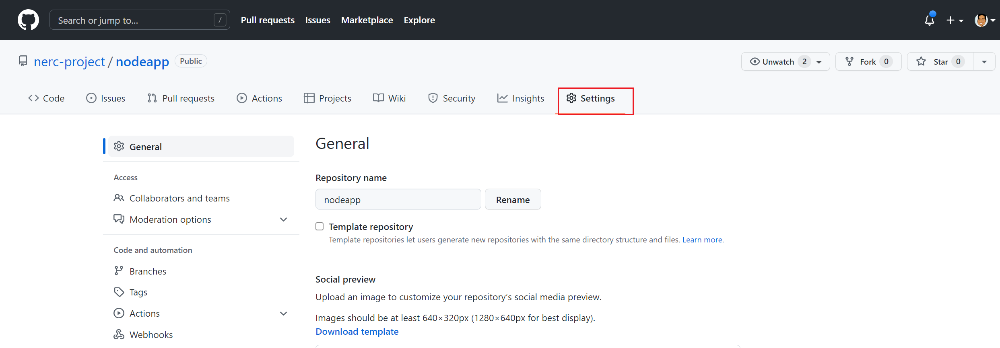

# How to Integrate Your GitHub Repository to Your Jenkins Project

This explains how to add a GitHub Webhook in your Jenkins Pipeline that saves your
time and keeps your project updated all the time.

!!! note "Prerequisite"
    You need to have setup CI/CD Pipelines on NERC's OpenStack by following
    [this document](setup-CI-CD-pipeline.md).

## What is a webhook?

A webhook is an HTTP callback, an HTTP POST that occurs when something happens through
a simple event-notification via HTTP POST. Github provides its own webhooks options
for such tasks.

## Configuring GitHub

Let's see how to configure and add a webhook in GitHub:

1. Go to your GitHub project repository.

2. Click on **"Settings"**. in the right corner as shown below:

    

3. Click on "Webhooks" and then "Click "Add webhooks."

    

4. In the "Payload URL" field paste your Jenkins environment URL. At the end of this
URL add **/github-webhook/** using `http://<Worker_Node_Floating_IP>:8080/github-webhook/`
i.e. `http://199.94.60.4:8080/github-webhook/`.
Select "Content type" as "application/json" and leave the "Secret" field empty.

    

5. In the page "Which events would you like to trigger this webhook?" select the
option "Let me select individual events." Then, check "Pull Requests" and "Pushes".
At the end of this option, make sure that the "Active" option is checked and then
click on "Add webhook" button.

    

We're done with the configuration on GitHub's side! Now let's config on Jenkins side
to use this webhook.

## Configuring Jenkins

1. In Jenkins, click on "New Item" to create a new project.

2. Give your project a name, then choose "Freestyle project" and finally, click
on "OK" button.

    

3. Click on the "Source Code Management" tab.

4. Click on Git and paste your GitHub repository URL in the ‘Repository URL’ field.
Also, you can specify the "Branches to build" to your project's **"main"** branch.

    

5. Now go to the Jenkins pipeline and select "GitHub hook trigger for GITScm polling."

    

That's it! in this way we can add a webhook to our job and ensure that everytime
you commits your changes to your Github repo, GitHub will trigger your new Jenkins
job.

---
