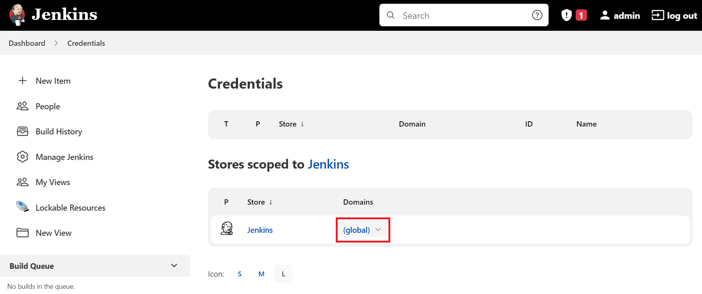
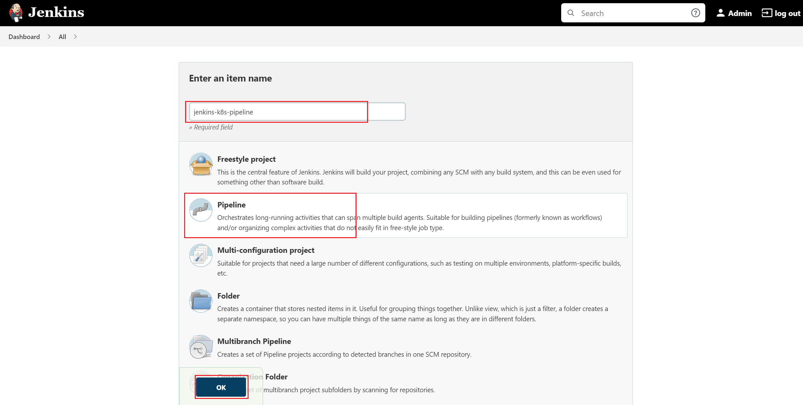
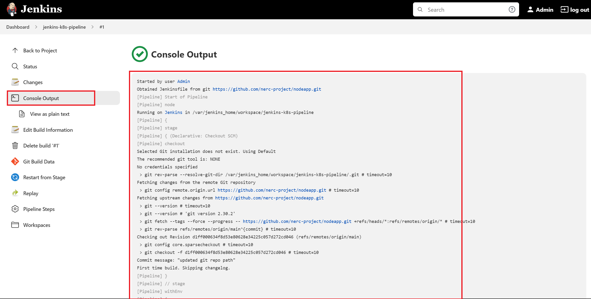

# How to setup CI/CD Pipelines on NERC's OpenStack

This document will walk you through how to setup a minimal **"CI/CD Pipeline To Deploy
To Kubernetes Cluster Using a CI/CD tool called Jenkins"** on your NERC's OpenStack
environment. Jenkins uses the Kubernetes control plane on K8s Cluster to run pipeline
tasks that enable DevOps to spend more time coding and testing and less time
troubleshooting.

!!! note "Prerequisite"
    You need Kubernetes cluster running in your OpenStack environment. To setup your
    K8s cluster please [Read this](../kubernetes/kubeadm/single-master-clusters-with-kubeadm.md).


*Figure: CI/CD Pipeline To Deploy To Kubernetes Cluster Using Jenkins on NERC*

Please follow the following steps:

- Install a Jenkins Server on one of your Worker Node on your K8s Cluster. This will
act as both Jenkins master and slave in this case. But you can just setup a Jenkins
Slave on one of your K8s worker node and the master on an external
OpenStack Instance too.

- Setup a Security Rules with the following rules and attach it to the worker node
where you will install the Jenkins Server.


After [SSH'ing](../../openstack/create-and-connect-to-the-VM/bastion-host-based-ssh/index.md)
to your worker node where you want to install the Jenkins server, To install a
Jenkins server using Docker run the following command:

```ssh
docker run -u 0 --privileged --name jenkins -it -d -p 8080:8080 -p 50000:50000 \
    -v /var/run/docker.sock:/var/run/docker.sock \
    -v $(which docker):/usr/bin/docker \
    -v $(which kubectl):/usr/bin/kubectl \
    -v /home/jenkins_home:/var/jenkins_home \
    jenkins/jenkins:latest
```

Once successfully docker run, browse to `http://<Worker_Node_Floating_IP>:8080`
this will show you where i.e. `/var/jenkins_home/secrets/initialAdminPassword`
you can copy the comtent from that file to paste it to the password field shown
on web GUI on the browser as the initial Administrator password as shown below:


**OR**, you can run `docker ps` on worker node where you run the Jenkins server.
Note the **Name** of the docker container and then run: `docker logs -f <enkins_docker_container_name>`.
This will show the initial Administrator password on the terminal which you can
copy and paste on the web GUI on the browser.

!!! note "Initial Admin Password"
    The initial admin password can be found between the rows of asterisks.

- Once you login to the Jenkins Web UI by entering the admin password shown on CLI
terminal, click on the "Install suggested plugins" button as shown below:


Continue by selecting 'Continue as admin' and then click the 'Save and Finish' button.

And then, Jenkins is ready to use as showing below:


- Jenkins has a wide range of plugin options. From your Jenkins dashboard navigate
to "Manage Jenkins > Manage Plugins" as shown below:


Select the "Available" tab and then locate **Docker pipeline** by searching and then
click "Install without restart" button as shown below:


Also, install the **Kubernetes CLI** plugin that allows you to configure `kubectl`
commands on Jenkinsfile to interact with Kubernetes clusters as shown below:


- Create a global credential for your Docker Hub Registry by providing the username
and password that will be used by the Jenkins pipelines:

    1. Click on the "Manage Jenkins" menu and then click on the "Manage Credentials"
      link as shown below:
      

    2. Click on Jenkins Store as shown below:
        

        The credentials can be added by clicking the 'Add Credentials' button in
        the left pane.

          

- First, add the **'DockerHub'** credentials as 'Username and password' with the
ID `dockerhublogin`.

    a. Select the Kind "Username and password" from the dropdown options.

    b. Provide your Docker Hub Registry's username and password.

    c. Give its ID and short description. ID is very important is that will need
    to be specify as used on your Jenkinsfile i.e. `dockerhublogin`.

    

- Config the **'Kubeconfig'** credentials as 'Secret file' that holds Kubeconfig
file from K8s master i.e. located at `/etc/kubernetes/admin.conf` with the ID 'kubernetes'

    a. Click on the "Add Credentials" button in the left pane.

    b. Select the Kind "Secret file" from the dropdown options.

    c. On **File** section choose the config file that contains the **EXACT** content
    from your **K8s master's kubeconfig file** located at: `/etc/kubernetes/admin.conf`

    d. Give a ID and description that you will need to use on your Jenkinsfile
    i.e. `kubernetes`.

    

  Once both credentials are successfully added the following credentials are shown:
  
  

- Write a Jenkins Pipeline Script file named as ‘**Jenkinsfile**’ as following:

```sh
pipeline {

  environment {
    dockerimagename = "milstein/nodeapp:${env.BUILD_NUMBER}"
    dockerImage = ""
  }

  agent any

  stages {

    stage('Checkout Source') {
      steps {
        git branch: 'main', url: 'https://github.com/nerc-project/nodeapp.git'
      }
    }

    stage('Build image') {
      steps{
        script {
          dockerImage = docker.build dockerimagename
        }
      }
    }

    stage('Pushing Image') {
      environment {
        registryCredential = 'dockerhublogin'
      }
      steps{
        script {
          docker.withRegistry('https://registry.hub.docker.com', registryCredential){
            dockerImage.push()
          }
        }
      }
    }

    stage('Docker Remove Image') {
      steps {
        sh "docker rmi -f ${dockerimagename}"
        sh "docker rmi -f registry.hub.docker.com/${dockerimagename}"
      }
    }

    stage('Deploying App to Kubernetes') {      
      steps {
        sh "sed -i 's/nodeapp:latest/nodeapp:${env.BUILD_NUMBER}/g' deploymentservice.yml"
        withKubeConfig([credentialsId: 'kubernetes']) {
          sh 'kubectl apply -f deploymentservice.yml'
        }
      }
    }
  }
}
```

!!! tip "Very Important Information"
    Above added global credentials such as `dockerhublogin` is the ID given during
    the credential saving steps mentioned above. Similarly, `kubernetes` is the ID
    given for Kubeconfig credential file.

This Jenkinsfile is also located at the root of our demo application git repo
from where we can reference on our Jenkins pipeline steps. For example, in this
case we are using: `https://github.com/nerc-project/nodeapp` as our git repo;
where our Node.js application resides.

!!! note "Other way to Generate Pipeline Jenkinsfile"
    You can generate your custom Jenkinsfile by clicking on **"Pipeline Syntax"**
    link shown when you create a new Pipeline when clicking the "New Item" menu link.

- Once you review the provided **Jenkinsfile** and understand the stages,
you can now create a pipeline to trigger it on your newly setup Jenkins server:

    a. Click on the "New Item" link.

    b. Select the "Pipeline" link.

    c. Give name to your Pipeline i.e. “*jenkins-k8s-pipeline*”
      

    d. Select "Build Triggers" tab and then select
    **Github hook tirgger for GITScm polling** as shown below:
      

    e. Select "Pipeline" tab and then select the "Pipeline script from SCM" from
    the dropdown options. Then you need to specify the **Git** as SCM and also "Repository
    URL" for your public git repo and also specify your branch and Jenkinsfile's
    name as shown below:
      

    **OR**, You can copy/paste the content of your Jenkinsfile on the given textbox.
    Please make sure you are selecting the "Pipeline script" from the dropdown options.
      

    f. Click on "Save" button.

- Finally, click on the **"Build Now"** menu link on right side navigation that will
triggers the Pipeline process i.e. Build docker image, Push Image to your Docker
Hub Registry and Pull the image from Docker Registry, Remove local Docker images
and then Deploy to K8s Cluster as shown below:


You can see the deployment to your K8s Cluster is successful then you can browse
the output using `http://<Worker_Node_Floating_IP>:<NodePort>` as shown below:


You can see the Console Output logs of this pipeline process by clicking the icon
before the id of the started Pipeline on the right bottom corner.



The pipeline stages after successful completion looks like below:


We will continue on [next documentation](integrate-your-GitHub-repository.md) on
how to setup GitHub Webhook in your Jenkins Pipeline so that Jenkins will trigger
the build when a devops commits code to your GitHub repository's specific branch.

---
