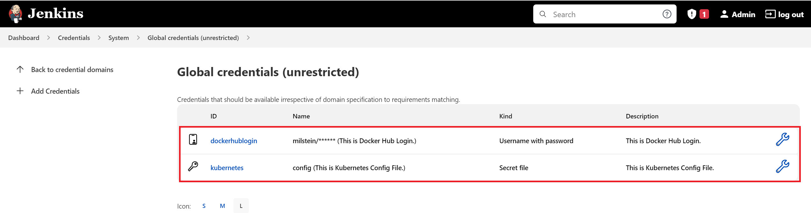
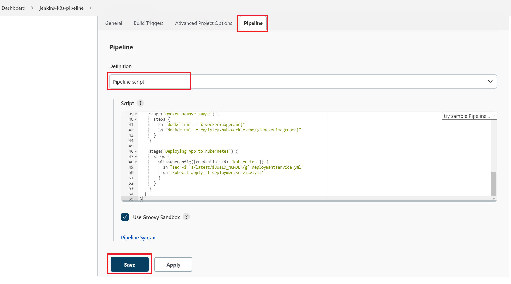
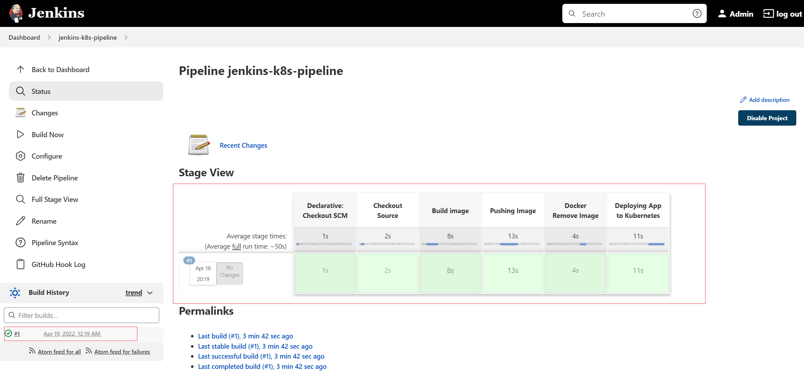

# How to setup CI/CD Pipelines on NERC's OpenStack

This document will walk you through how to setup a minimal **"CI/CD Pipeline To Deploy
To Kubernetes Cluster Using a CI/CD tool called Jenkins"** on your NERC's OpenStack
environment. Jenkins uses the Kubernetes control plane on K8s Cluster to run pipeline
tasks that enable DevOps to spend more time coding and testing and less time
troubleshooting.

!!! note "Prerequisite"
    You need Kubernetes cluster running in your OpenStack environment. To setup your
    K8s cluster please [Read this](../kubernetes/kubeadm/single-master-clusters-with-kubeadm.md).


*Figure: CI/CD Pipeline To Deploy To Kubernetes Cluster Using Jenkins on NERC*

Please follow the following steps:

- Install a Jenkins Server on one of your Worker Node on your K8s Cluster. This will
act as both Jenkins master and slave in this case. But you can just setup a Jenkins
Slave on one of your K8s worker node and the master on an external
OpenStack Instance too.

- Setup a Security Rules with the following rules and attach it to the worker node
where you will install the Jenkins Server.


After [SSH'ing](../../openstack/create-and-connect-to-the-VM/bastion-host-based-ssh/index.md)
to your worker node where you want to install the Jenkins server, To install a
Jenkins server using Docker run the following command:

```ssh
docker run -u 0 --privileged --name jenkins -it -d -p 8080:8080 -p 50000:50000 \
    -v /var/run/docker.sock:/var/run/docker.sock \
    -v $(which docker):/usr/bin/docker \
    -v /home/jenkins_home:/var/jenkins_home \
    jenkins/jenkins:latest
```

Once successfully docker run, browse to `http://<Worker_Node_Floating_IP>:8080`
this will show you where i.e. `/var/jenkins_home/secrets/initialAdminPassword`
you can copy the comtent from that file to paste it to the password field shown
on web GUI on the browser as the initial Administrator password.

**OR**, you can run `docker ps` on worker node where you run the Jenkins server.
Note the **Name** of the docker container and then run: `docker logs -f <enkins_docker_container_name>`.
This will show the initial Administrator password on the terminal which you can
copy and paste on the web GUI on the browser.

- Once you login to the Jenkins Web UI by entering the admin password shown on CLI
terminal, click on the "Install suggested plugins" button.

- Create First Admin User with username and password and then it will give Jenkins
URL to browse.

- From your Jenkins dashboard navigate to "Manage Jenkins > Manage Plugins" and
select the Available tab as shown below:


Locate **Docker pipeline** by searching and click "Install without restart" button
as shown below:


The available version 2.3.1 of **Kubernetes Continuous Deploy** will cause some error
while deploying to K8s so we need to install manually
**Kubernetes Continuous Deploy Version 1.0.0**

[Download Kubernetes Continuous Plugin 1.0.0 version](https://updates.jenkins.io/download/plugins/kubernetes-cd/1.0.0/kubernetes-cd.hpi)
from `https://updates.jenkins.io/download/plugins/kubernetes-cd/1.0.0/kubernetes-cd.hpi`

To install downloaded file go to "Advanced" tab and then upload it to the
"Deploy Plugin" section and then click "Deploy" button as shown below:


- Create a global credential for your Docker Hub Registry by providing the username
and password that will be used by the Jenkins pipelines:

    1. Click on the "Manage Jenkins" menu and then click on the "Manage Credentials"
      link as shown below:
      

    2. Click on Jenkins Store as shown below:
      
      Then, it will show the Global credentials which you need to click to add new
      credential.
      
      

    3. Select the Kind "Username and password" from the dropdown options.

    4. Provide your Docker Hub Registry's username and password.

    5. Give its ID and description. which you will need to be specify on your Jenkinsfile.

    

- Config the kube config from K8s master as a new Credential:

    1. Click on the "Manage Jenkins" menu and then click on the "Manage Credentials"
    link.
    2. Select the Kind "Kubernetes configuration (kubeconfig)" from the dropdown
    options.
    3. Give a ID and description that you will need to use on your Jenkinsfile.
    4. On **Kubeconfig** section select "Enter directly".
    5. Copy content from your K8s master’s kubeconfig file located at: `/etc/kubernetes/admin.conf`.

    

  Once both credentials are successfully added the following credentials are shown:

    

- Write a Jenkins Pipeline Script file named as ‘**Jenkinsfile**’ as following:

```sh
pipeline {

  environment {
    dockerimagename = "milstein/nodeapp"
    dockerImage = ""
  }

  agent any

  stages {

    stage('Checkout Source') {
      steps {
        git branch: 'main', url: 'https://github.com/Milstein/nodeapp.git'
      }
    }

    stage('Build image') {
      steps{
        script {
          dockerImage = docker.build dockerimagename
        }
      }
    }

    stage('Pushing Image') {
      environment {
               registryCredential = 'dockerhublogin'
           }
      steps{
        script {
          docker.withRegistry('https://registry.hub.docker.com', registryCredential){
            dockerImage.push("latest")
          }
        }
      }
    }

    stage('Deploying App to Kubernetes') {
      steps {
        script {
          kubernetesDeploy(configs: "deploymentservice.yml", kubeconfigId: "kubernetes")
        }
      }
    }
  }
}
```

This Jenkinsfile will checkout git repo from your application github repo. For
example, in this case we are using: `https://github.com/Milstein/nodeapp` as
our git repo where our Node.js application resides. `dockerhublogin` is the ID
given during the credential saving steps mentioned above. Similarly, `kubernetes`
is the ID given for Kubeconfig credential.

!!! note "Other way to Generate Pipeline Jenkinsfile"
    You can generate your custom Jenkinsfile by clicking on **"Pipeline Syntax"**
    link shown when you create a new Pipeline when clicking the "New Item" menu link.

- Once your Jenkinsfile is ready and reviewed you can now create a pipeline to
trigger it on your newly setup Jenkins server:

    1. Click on the "New Item" link.
    2. Select the "Pipeline" link.
    3. Give name to your Pipeline i.e. “*Jenkins to K8s pipeline*”
      

    4. Select "Pipeline" tab and then copy/paste the content of your Jenkinsfile
    on the given textbox. Please make sure you are selecting the "Pipeline script"
    from the dropdown options.
      

- Finally, click on the **"Build Now"** menu link on right side navigation that will
triggers the Pipeline process i.e. Build docker image, Push Image to your Docker
Hub Registry and Pull the image from Docker Registry and Deploy to K8s Cluster.
You can see the Console Output logs of this pipeline process by clicking the icon
before the id of the started Pipeline on the right bottom corner.

  

The pipeline stages after successful completion looks like below:



You can see the deployment to your K8s Cluster is successful then you can browse
the output using `http://<Worker_Node_Floating_IP>:<NodePort>` as shown below:


We will continue on [next documentation](integrate-your-GitHub-repository.md) on
how to setup GitHub Webhook in your Jenkins Pipeline so that Jenkins will trigger
the build when a devops commits code to your GitHub repository's specific branch.

---
