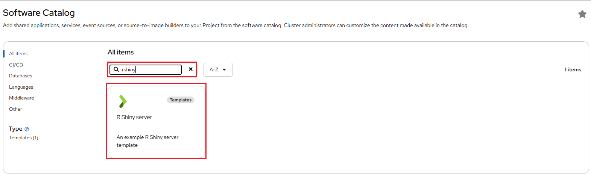
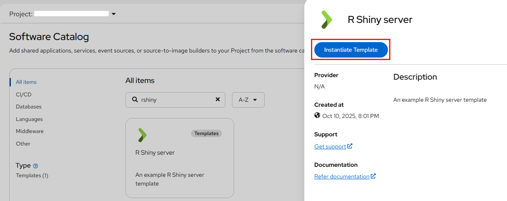
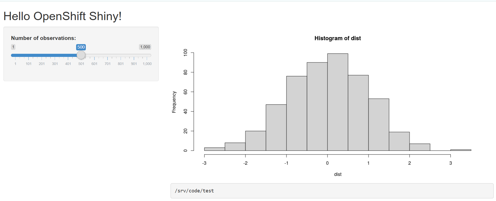

# Running R Shiny Server on NERC

## Running R Shiny Server on NERC OpenStack

### Setup R Shiny Server using Terraform

Refer to [this documentation](../../../openstack/advanced-openstack-topics/terraform/terraform-on-NERC.md#template-to-setup-r-shiny-server-using-terraform-on-your-nerc-project)
on using Terraform to set up an [R Shiny Server](https://www.rstudio.com/products/shiny/shiny-server/)
on your NERC OpenStack.

To get started, you will need to clone the repository using:

```sh
git clone https://github.com/nerc-project/terraform-nerc-r-shiny.git
```

### Setup R Shiny Server while launching a VM

Within the [terraform-nerc-r-shiny repo](https://github.com/nerc-project/terraform-nerc-r-shiny.git),
it includes the bash script file i.e. `install-R-Shiny-<OS>.sh` required to setup
the R Shiny Server. You can use a custom user-defined bash script based on your
selected Image OS while launching an instance.

[During the launch](../../../openstack/create-and-connect-to-the-VM/launch-a-VM.md#ignore-other-tabs),
in the **"Configuration"** tab, you can enter the script in the
**"CustomizationScript"** text area or upload the script file directly.

!!! warning "Which R Shiny Script i.e. `install-R-Shiny-<OS>.sh` to Choose?"

    Please use the appropriate bash script file i.e. `install-R-Shiny-<OS>.sh` based
    on your operating system (OS):

    - **AlmaLinux** → `install-R-Shiny-AlmaLinux.sh`

    - **CentOS** → `install-R-Shiny-Centos.sh`

    - **Ubuntu** → `install-R-Shiny-Ubuntu.sh`

## Running R Shiny Server on NERC OpenShift

We have used the [Base Docker image](https://github.com/Duke-GCB/openshift-shiny/master/dockerfiles/shiny-verse)
compatible with OpenShift to create an **OpenShift Template**. Here, we walk through
the process of creating a simple R Shiny Server template that bundles all the
necessary resources—ConfigMap, Pod, Route, Service, etc.—and then deploy a Shiny
application using that template.

To get started, clone the repository using:

```sh
git clone https://github.com/nerc-project/rshiny-testapp.git
```

### Steps to Prepare Your Git Repo with Application Source Code

To get started, create a new Git repository and add a `Dockerfile` to specify the
base image i.e. `dukegcb/openshift-shiny-verse:4.1.2`, additional **package** requirements,
and the location of your Shiny application code.

For example, if your app is under the `src` directory and has no additional requirements,
your `Dockerfile` should look like this:

```dockerfile
FROM dukegcb/openshift-shiny-verse:4.1.2
RUN install2.r here
ADD ./src /srv/code
```

!!! info "Important Note"

    The `install2.r` script is a simple utility to install R packages that is provided
    by the `rocker` images.

A sample Shiny application is available within the [Git Repository](https://github.com/nerc-project/rshiny-testapp),
which includes the `Dockerfile` and the `src` directory containing `app.R`.

!!! note "More about Writing Templates"

    For more options and customization please [read this](https://docs.openshift.com/container-platform/4.17/applications/creating_applications/using-templates.html#templates-writing_using-templates).

### Deploy your shiny app using the OpenShift Web console

Here, we walk through the process of creating a simple R Shiny Web Server using
an OpenShift Template, which bundles all the necessary resources required to run
it, such as ImageStream, BuildConfig, Deployment, Route, Service, etc., and then
initiates and deploys a Shiny application from that template.

An OpenShift template file, `rshiny-server-template.yaml`, is available within the
[Git Repository](https://github.com/nerc-project/rshiny-testapp) under the
`openshift` directory.

!!! note "More about Writing Templates"

    For more options and customization please [read this](https://docs.openshift.com/container-platform/4.17/applications/creating_applications/using-templates.html#templates-writing_using-templates).

1. Click the "Import YAML" button, represented by the "+" icon in the top navigation
   bar, or navigate to the **From Local Machine** section and select **Import YAML**,
   as shown below:

    

2. On opened YAML editor paste the contents of the template copied from the
   `openshift/rshiny-server-template.yaml` file located at the provided [Git Repo](https://raw.githubusercontent.com/nerc-project/rshiny-testapp/main/openshift/rshiny-server-template.yaml).

    

3. You need to find the Developer Catalog section and then select **All services**
   option as shown below:

    

4. Then, you will be able to use the created Developer Catalog template by searching
   for "rshiny" on catalog as shown below:

    

5. Once selected by clicking the template, you will see Instantiate Template web
   interface as shown below:

    

6. Based on our template definition, we request that users input some **variables**
   to initate the R Shiny Server.

    !!! note "Variables"

        All variables are mandatory for the application to be created.

        -   **APP_NAME** - Name used for the app

        -   **APP_LABEL** - Label used for the app

        -   **APP_GIT_URI** - GitHub repository URL

        -   **APP_GIT_BRANCH** - Git branch to build from

        -   **REPO_DOCKERFILE_PATH** - Location of the shiny app Dockerfile

        -   **IMAGE_TAG** - Tag for the built image

        -   **NAMESPACE** - Namespace where the application will be deployed

        -   **PROBE_INITIAL_DELAY** - Initial delay in seconds for liveness and readiness probes

        -   **PROBE_TIMEOUT** - Timeout in seconds for liveness and readiness probes

    

    !!! danger "Important: Update the Variable Values According to Your Own Configuration!"

        It is essential to update the variable values in the OpenShift template
        to align with your specific configuration. Ensure that these values are
        adjusted according to your environment and requirements before deployment.
        If variable values are not explicitly provided, the template will automatically
        use its default values.

7. Once successfully initiated, you can either open the application URL using the
   **Open URL** icon as shown below or you can naviate to the route URL by
   navigating to the "Routes" section under the _Location_ path as shown below:

    

8. Finally, you will be able to see the R Shiny app!

    

!!! note "Modifying uploaded templates"

    You can edit a template that has already been uploaded to your project:
    `oc edit template <template>`.

### Deploy your shiny app using the OpenShift CLI (`oc`)

-   **Prerequisites**:

    Setup the OpenShift CLI (`oc`) Tools locally and configure the OpenShift CLI
    to enable `oc` commands. Refer to [this user guide](../../openshift/logging-in/setup-the-openshift-cli.md).

    !!! info "Information"

        Some users may have access to multiple projects. Run the following command to
        switch to a specific project space: `oc project <your-project-namespace>`.

    Please confirm the correct project is being selected by running `oc project`,
    as shown below:

        oc project
        Using project "<your_openshift_project_to_add_r_shiny_app>" on server "https://api.shift.nerc.mghpcc.org:6443".

#### Deploy your R Shiny application

Process and apply template using default values from the template and passing your
application specific parameters.

```sh
oc process -f ./openshift/rshiny-server-template.yaml \
   -p APP_GIT_URI=<YOUR_GIT_REPO> \
   -p APP_GIT_BRANCH=<YOUR_GIT_BRANCH> \
   -p REPO_DOCKERFILE_PATH=<PATH_TO_DOCKERFILE_IN_YOUR_REPO> \
   -p NAMESPACE=$(oc project --short) \
   | oc create -f -
```

For example, the command will look like this:

```sh
oc process -f ./openshift/rshiny-server-template.yaml \
    -p APP_GIT_URI=https://github.com/nerc-project/rshiny-testapp \
    -p APP_GIT_BRANCH=main \
    -p REPO_DOCKERFILE_PATH="Dockerfile" \
    -p NAMESPACE=$(oc project --short) \
    | oc create -f -
```

!!! info "Important: Default Template Values Will Be Used If Not Overridden!"

    If variable values are not explicitly provided, the template will automatically
    use its default values.

### Deleting your application and all its resources

Either using the OpenShift Web console, you can **Right click** on the application
box and then confirm to delete it as shown below:


Alternatively, you can use the OpenShift CLI i.e. `oc` commands to delete all
application resources:

```sh
oc delete all -l app=<APP_LABEL>
oc delete svc <APP_NAME>-service
oc delete route <APP_NAME>-route
oc delete bc <APP_NAME>-build
oc delete deploy <APP_NAME>-deployment
oc delete imagestream <APP_NAME>-imagestream
oc delete template shiny-server-template
```

For example, the command will look like this:

```sh
oc delete all -l app=shiny
oc delete svc shiny-app-service
oc delete route shiny-app-route
oc delete bc shiny-app-build
oc delete deploy shiny-app-deployment
oc delete imagestream shiny-app-imagestream
oc delete template shiny-server-template
```

---
