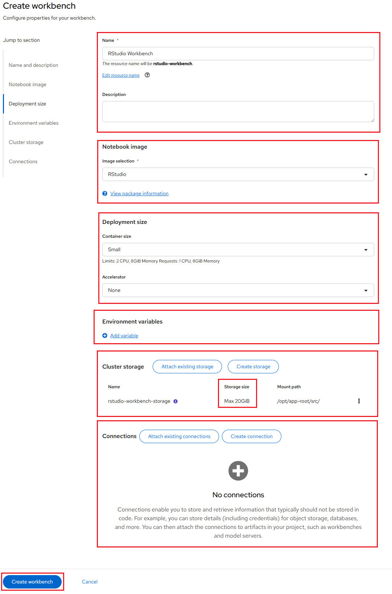

# Running RStudio Server on NERC

## Deploying as a Workbench Using a Data Science Project (DSP) on NERC RHOAI

1.  Navigating to the OpenShift AI dashboard.

    Please follow [these steps](../../../openshift-ai/logging-in/access-the-rhoai-dashboard.md)
    to access the NERC OpenShift AI dashboard.

2.  Please ensure that you start your RStudio Web server with options as depicted
    in the following configuration screen. This screen provides you with the opportunity
    to select a notebook image and configure its options, including the Accelerator
    and Number of accelerators (GPUs).

    

    For our example project, let's name it "RStudio Workbench". We'll select the
    **RStudio** image, choose a **Deployment size** of **Small**, choose **Accelerator**
    of **None** (no GPU is needed for this setup), and allocate a **Cluster storage**
    space of **20GB** (By Default Selected).

    !!! tip "Tip"

        The dashboard currently enforces a minimum storage volume size of 20GB.
        Please ensure that you modify this based on your need in **Cluster Storage**.

3.  If this procedure is successful, you have started your RStudio Web Server. When
    your workbench is ready and the status changes to _Running_, click the open
    icon () next to your workbench's name, or
    click the workbench name directly to access your environment:

    

4.  Once you have successfully authenticated by clicking "**mss-keycloak**" when
    prompted, as shown below:

    

    Next, you should see the RStudio Web Server, as shown below:

    

## Running RStudio Server on NERC OpenShift

In [this guide](../../../openshift/applications/creating-your-own-developer-catalog-service.md),
we walk through the process of creating a simple RStudio Web Server using an
OpenShift Template, which bundles all the necessary resources required to run it,
such as ConfigMap, Pod, Route, Service, etc., and then initiate and deploy the
RStudio server from that template.

To get started, clone the repository by running:

```sh
git clone https://github.com/nerc-project/rstudio-testapp.git
```

After that, follow the steps outlined in [that guide](../../../openshift/applications/creating-your-own-developer-catalog-service.md).
At the end, you will be able to view the RStudio Web Server interface!


---
