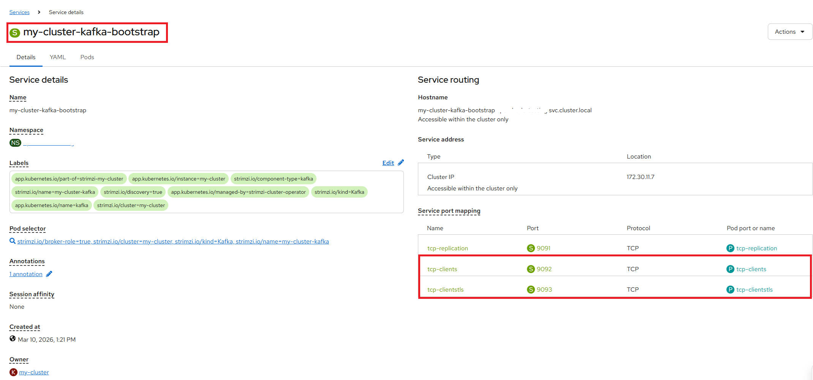

# Apache Kafka on NERC OpenShift

## Apache Kafka Overview

[Apache Kafka](https://kafka.apache.org/) is a distributed event streaming platform
capable of handling high-throughput, fault-tolerant streaming workloads. Kafka is
designed for real-time data pipelines and streaming applications.

Core concepts:

-   **Broker**: A Kafka server that stores and serves messages.

-   **Topic**: A named stream to which producers publish records and from which
    consumers read records.

-   **Partition**: Topics are split into partitions for parallelism and fault tolerance.

-   **Producer**: A client application that publishes records to one or more topics.

-   **Consumer**: A client application that subscribes to topics and processes records.

-   **Consumer Group**: A group of consumers that collectively consume a topic.

Running Kafka on [NERC OpenShift](https://nerc-project.github.io/nerc-docs/openshift/)
is accomplished using the **[Strimzi Operator](https://strimzi.io/)**, which is
the standard Kubernetes-native method for deploying Kafka on OpenShift.

## Prerequisites

Before proceeding, ensure you have:

-   Access to a [NERC OpenShift project](../../openshift/logging-in/access-the-openshift-web-console.md)
    with active [ColdFront OpenShift Allocation](../../get-started/allocation/allocation-details.md#general-user-view-of-openshift-resource-allocation).

-   Make sure you have the `oc` CLI tool installed and configured on your local
    machine following [these steps](../../openshift/logging-in/setup-the-openshift-cli.md#first-time-usage).

-   Log in to the NERC OpenShift cluster and switch to your project namespace:

    ```sh
    oc login --token=<your_token> --server=https://api.shift.nerc.mghpcc.org:6443  
    ```

    For example:

    ```sh
    oc login --token=<your_token> --server=https://api.shift.nerc.mghpcc.org:6443
    Logged into "https://api.shift.nerc.mghpcc.org:6443" as "<your_account>" using the token provided.  
    ```

    !!! info "Information"

        Some users may have access to multiple projects. Run the following command to
        switch to a specific project space: `oc project <your-project-namespace>`.
        For example: `oc project ds551-kafka`.

    Please confirm the correct project is being selected by running `oc project`,
    as shown below:

        oc project
        Using project "<your-project-namespace>" on server "https://api.shift.nerc.mghpcc.org:6443".

-   Sufficient quota in your project (**at least 3 vCPUs and 6 GiB memory** recommended
    for a minimal Kafka cluster)

!!! note "Checking Your Quota"

    You can view your project's resource quota by running:

    ```sh
    oc describe quota -n <your-project-namespace>
    ```

    If you need [additional resources](../../get-started/allocation/allocation-change-request.md#request-change-resource-allocation-attributes-for-openshift-project), contact
    your project PI or Manager(s) to increase the resource quota.

!!! note "Kafka Infrastructure is Pre-Deployed"

    The Strimzi Operator is already installed cluster-wide on NERC OpenShift.
    You do **not** need to install the operator yourself. However, you **will**
    need to create your own Kafka cluster and topics in your project namespace
    using the provided YAML manifests below.

## Create a Kafka Cluster

As the **Strimzi Operator** is available (which it is cluster-wide), you can deploy
a Kafka cluster in your project namespace by creating a `Kafka` custom resource
and a `KafkaNodePool` resource.

!!! warning "Important: KafkaNodePool is Required"

    As of Kafka 4.0+, Strimzi uses `KafkaNodePool` to define broker and controller
    nodes. Both resources must be created together. The `KafkaNodePool` should
    define at least one node pool with both `broker` and `controller` roles for
    KRaft mode operation. Without a KafkaNodePool, the Kafka cluster will not
    deploy.

-   Create a file named `kafka-cluster.yaml` with the Kafka cluster definition:

    ```yaml
    apiVersion: kafka.strimzi.io/v1
    kind: KafkaNodePool
    metadata:
      name: dual-role
      namespace: <your-project-namespace>
      labels:
        strimzi.io/cluster: my-cluster
    spec:
      replicas: 1
      roles:
        - controller
        - broker
      storage:
        type: ephemeral # Recommended for development only
        size: 1Gi
    ---
    apiVersion: kafka.strimzi.io/v1
    kind: Kafka
    metadata:
      name: my-cluster
      namespace: <your-project-namespace>
    spec:
      kafka:
        version: 4.1.1
        listeners:
          - name: plain
            port: 9092
            type: internal
            tls: false
          - name: tls
            port: 9093
            type: internal
            tls: true
        config:
          offsets.topic.replication.factor: 1
          transaction.state.log.replication.factor: 1
          transaction.state.log.min.isr: 1
          default.replication.factor: 1
          min.insync.replicas: 1
      entityOperator:
        topicOperator: {}
        userOperator: {}
    ```

    !!! warning "Very Important Note"

        - Kafka 4.0+ requires `KafkaNodePool` with both `broker` and `controller`
          roles for **[KRaft (Kraft Raft)](https://developer.confluent.io/learn/kraft/)**
          consensus mode operation.

        - This configuration uses **Ephemeral storage** (`1Gi`) suitable for testing
          and demo purposes. For production or larger workloads, use
          **Persistent storage** and increase the `size` value or use a specific
          `storageClass`.

        - Make sure the `KafkaNodePool` metadata includes the label
          `strimzi.io/cluster: my-cluster` to link it to the Kafka resource.

-   Apply the Kafka cluster definition:

    ```sh
    oc apply -f kafka-cluster.yaml -n <your-project-namespace>
    ```

-   Watch the cluster come up. It may take 3–5 minutes for all pods to reach
    `Running` status:

    ```sh
    oc get pods -n <your-project-namespace> -l strimzi.io/cluster=my-cluster -w
    ```

    A healthy cluster will show output similar to:

    ```sh
    NAME                                          READY   STATUS    RESTARTS   AGE
    my-cluster-dual-role-0                        1/1     Running   0          3m
    my-cluster-entity-operator-6d7f9c7d4b-xqtlp   2/2     Running   0          2m
    ```

    !!! note "Note about Kafka 4.0+ Differences"

        In Kafka `4.0+`:

        - There are **no ZooKeeper pods**. The broker manages its own metadata
          using KRaft.

        - Pod names follow the pattern `<cluster-name>-<nodepool-name>-<id>`.

        - With this single-node setup using `dual-role`, you'll see pods named
          `my-cluster-dual-role-0`.

## Create a Kafka Topic

-   Create a file named `kafka-topic.yaml`:

    ```yaml
    apiVersion: kafka.strimzi.io/v1
    kind: KafkaTopic
    metadata:
      name: my-topic
      namespace: <your-project-namespace>
      labels:
        strimzi.io/cluster: my-cluster
    spec:
      partitions: 3
      replicas: 1
      config:
        retention.ms: 7200000
        segment.bytes: 1073741824
    ```

-   Apply the topic:

    ```sh
    oc apply -f kafka-topic.yaml -n <your-project-namespace>
    ```

-   Verify the topic was created:

    ```sh
    oc get kafkatopic my-topic -n <your-project-namespace>
    ```

    Expected output:

    ```sh
    NAME       CLUSTER      PARTITIONS   REPLICATION FACTOR   READY
    my-topic   my-cluster   3            1                    True
    ```

Strimzi ships with pre-built container images with Kafka command-line tools that
you can use to verify your cluster is working correctly.

### Run a Producer

The producer tool lets you send messages to a Kafka topic. In interactive mode,
you can type messages directly:

-   Start a producer pod in interactive mode:

    ```sh
    oc run kafka-producer -ti \
      --image=quay.io/strimzi/kafka:0.50.1-kafka-4.1.1 \
      --rm=true --restart=Never \
      -n <your-project-namespace> \
      -- bash -c 'bin/kafka-console-producer.sh \
        --bootstrap-server my-cluster-kafka-bootstrap:9092 \
        --topic my-topic'
    ```

    The `-ti` flags enable **interactive terminal mode**, which allows you to type
    messages at a prompt. The `--rm=true` flag automatically removes the pod after
    it exits.

-   At the prompt, type test messages and press `Enter` after each one:

    ```sh
    > Hello from NERC OpenShift!
    > This is a Kafka test message.
    ```

    Press `Ctrl+C` and `Enter` to stop the producer.

    !!! warning "Important: Interactive Mode (`-ti --rm`)"

        The `-ti --rm` flags work together to create an interactive session that
        automatically cleans up the pod. Do not use these flags in scripts or
        CI/CD pipelines - instead, pipe your messages to stdin or use a heredoc.

        For example:

        ```sh
        echo -e "message1\nmessage2" | oc run kafka-producer \
          --image=quay.io/strimzi/kafka:0.50.1-kafka-4.1.1 \
          --restart=Never \
          -n <your-project-namespace> \
          -i \
          -- bin/kafka-console-producer.sh \
            --bootstrap-server my-cluster-kafka-bootstrap:9092 \
            --topic my-topic
        ```

### Run a Consumer

-   In a separate terminal, start a consumer pod to read messages from the beginning:

    ```sh
    oc run kafka-consumer -ti \
      --image=quay.io/strimzi/kafka:0.50.1-kafka-4.1.1 \
      --rm=true --restart=Never \
      -n <your-project-namespace> \
      -- bash -c 'bin/kafka-console-consumer.sh \
        --bootstrap-server my-cluster-kafka-bootstrap:9092 \
        --topic my-topic \
        --from-beginning'
    ```

    You should see the messages published by the producer:

    ```sh
    Hello from NERC OpenShift!
    This is a Kafka test message.
    ```

    Press `Ctrl+C` to stop the consumer.

    !!! tip "Consumer Groups"

        To test multiple consumers sharing a topic workload, add the flag
        `--group <group-name>` to the consumer command. Each consumer in the same
        group will receive messages from a distinct subset of partitions.

## Connecting Applications to Kafka

Applications running in the same OpenShift project can access the Kafka broker
through the internal bootstrap service created during cluster setup, as shown below:



```sh
my-cluster-kafka-bootstrap:9092   # plaintext (no TLS)
my-cluster-kafka-bootstrap:9093   # TLS
```

For Python applications, use the [kafka-python](https://kafka-python.readthedocs.io/)
or [confluent-kafka](https://docs.confluent.io/kafka-clients/python/current/overview.html)
client libraries:

```python
from kafka import KafkaProducer, KafkaConsumer

# Producer example
producer = KafkaProducer(bootstrap_servers='my-cluster-kafka-bootstrap:9092')
producer.send('my-topic', b'Hello from Python!')
producer.flush()

# Consumer example
consumer = KafkaConsumer(
    'my-topic',
    bootstrap_servers='my-cluster-kafka-bootstrap:9092',
    auto_offset_reset='earliest',
    group_id='my-group'
)
for msg in consumer:
    print(f"Received: {msg.value.decode()}")
```

!!! note "Note"

    The bootstrap address `my-cluster-kafka-bootstrap` is an OpenShift Service
    created automatically by Strimzi Operator. It is only accessible from within
    the same project namespace.

    If external access is required, configure a `route` or `loadbalancer` type
    listener in the Kafka Custom Resource (CR).

## Clean Up Resources

When you are finished, remove all Kafka resources from your namespace to free
up project quota:

```sh
# Delete the Kafka topic
oc delete kafkatopic my-topic -n <your-project-namespace>

# Delete the Kafka cluster (also removes Entity Operator pods)
oc delete kafka my-cluster -n <your-project-namespace>

# Delete the KafkaNodePool
oc delete kafkanodepool dual-role -n <your-project-namespace> 2>/dev/null || true
```

!!! danger "Very Important Note"

    Deleting a Kafka cluster configured with **ephemeral storage** permanently removes
    all messages in that cluster. Ensure you have consumed or backed up any required
    data before proceeding.

    To create a **persistent Kafka cluster**, use **persistent-claim storage**:

    Persistent Volume Claims (PVCs) use Storage Classes (or the cluster default)
    to dynamically provision and bind durable storage to Kafka brokers.

    Strimzi allows you to specify the Storage Class, enabling the use of network
    or local persistent volumes.

    Example configuration:

    ```yaml
    ...
    apiVersion: kafka.strimzi.io/v1
    kind: KafkaNodePool
    ...
    spec:
      ...
      storage:
        type: persistent-claim  # Use Persistent Volume Claims
        size: 1Gi               # Storage per broker
        # class: "premium-storage"  # Optional StorageClass
    ...
    ```

---
