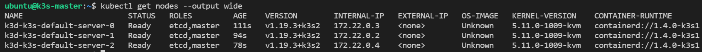
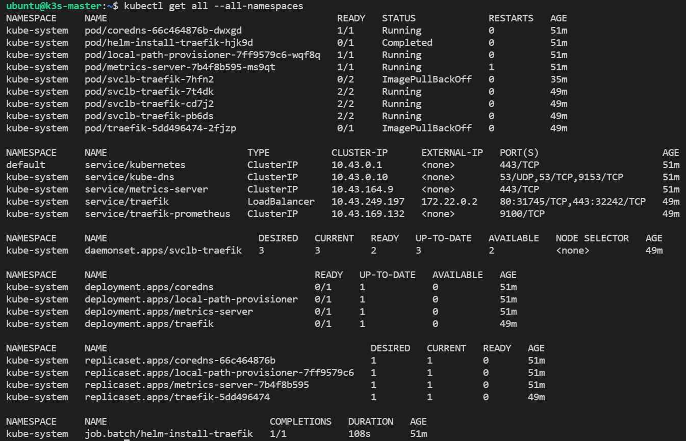

# Set up K3s in High Availability using k3d

First, Kubernetes HA has **two possible setups**: embedded or external database
(DB). We’ll use the **embedded DB** in this HA K3s cluster setup. For which `etcd`
is the default embedded DB.

There are some strongly recommended [Kubernetes HA best practices](https://kubernetes.io/docs/tasks/administer-cluster/highly-available-master/#best-practices-for-replicating-masters-for-ha-clusters)
and also there is [Automated HA master deployment doc](https://github.com/kubernetes/community/blob/master/contributors/design-proposals/cluster-lifecycle/ha_master.md).

## Pre-requisite

Make sure you have already installed k3d [following this](k3s-using-k3d.md#installing-k3d).

## HA cluster with at least three control plane nodes

```sh
k3d cluster create --servers 3 --image rancher/k3s:latest
```

Here, `--server 3`: specifies requests three nodes to be created with the role server
and `--image rancher/k3s:latest`: specifies the K3s image to be used here we are
using `latest`

-   Switch context to the new cluster:

    ```sh
    kubectl config use-context k3d-k3s-default
    ```

    You can now check what has been created from the different points of view:

    ```sh
    kubectl get nodes --output wide
    ```

    The output will look like:

    

    ```sh
    kubectl get pods --all-namespaces --output wide
    ```

    **OR,**

    ```sh
    kubectl get pods -A -o wide
    ```

    The output will look like:
    

## Scale up the cluster

You can quickly simulate the addition of another control plane node to the HA cluster:

```sh
k3d node create extraCPnode --role=server --image=rancher/k3s:latest

INFO[0000] Adding 1 node(s) to the runtime local cluster 'k3s-default'...
INFO[0000] Starting Node 'k3d-extraCPnode-0'
INFO[0018] Updating loadbalancer config to include new server node(s)
INFO[0018] Successfully configured loadbalancer k3d-k3s-default-serverlb!
INFO[0019] Successfully created 1 node(s)!
```

Here, `extraCPnode`: specifies the name for the node,
`--role=server` : sets the role for the node to be a control plane/server,
`--image rancher/k3s:latest`: specifies the K3s image to be used here we are
using `latest`

```sh
kubectl get nodes

NAME                       STATUS   ROLES         AGE   VERSION
k3d-extracpnode-0          Ready    etcd,master   31m   v1.19.3+k3s2
k3d-k3s-default-server-0   Ready    etcd,master   47m   v1.19.3+k3s2
k3d-k3s-default-server-1   Ready    etcd,master   47m   v1.19.3+k3s2
k3d-k3s-default-server-2   Ready    etcd,master   47m   v1.19.3+k3s2
```

**OR,**

```sh
kubectl get nodes --output wide
```

The output looks like below:


## Heavy Armored against crashes

As we are working with containers, the best way to "crash" a node is to literally
stop the container:

```sh
docker stop k3d-k3s-default-server-0
```

!!! note "Note"

    The Docker and k3d commands will show the state change immediately. However,
    the Kubernetes (read: K8s or K3s) cluster needs a short time to see the state
    change to NotReady.

```sh
kubectl get nodes

NAME                       STATUS     ROLES         AGE   VERSION
k3d-extracpnode-0          Ready      etcd,master   32m   v1.19.3+k3s2
k3d-k3s-default-server-0   NotReady   etcd,master   48m   v1.19.3+k3s2
k3d-k3s-default-server-1   Ready      etcd,master   48m   v1.19.3+k3s2
k3d-k3s-default-server-2   Ready      etcd,master   48m   v1.19.3+k3s2
```

Now it is a good time to reference again the load balancer k3d uses and how it is
critical in allowing us to continue accessing the K3s cluster.

While the load balancer internally switched to the next available node, from an
external connectivity point of view, we still use the same IP/host. This abstraction
saves us quite some efforts and it’s one of the most useful features of k3d.

Let’s look at the state of the cluster:

```sh
kubectl get all --all-namespaces
```

The output looks like below:



Everything looks right. If we look at the pods more specifically, then we will
see that K3s automatically self-healed by recreating pods running on the failed
node on other nodes:

```sh
kubectl get pods --all-namespaces --output wide
```

As the output can be seen:


Finally, to show the power of HA and how K3s manages it, let’s restart the node0
and see it being re-included into the cluster as if nothing happened:

```sh
docker start k3d-k3s-default-server-0
```

Our cluster is stable, and all the nodes are fully operational again as shown below:


## Cleaning the resources

```sh
k3d cluster delete
```

---
