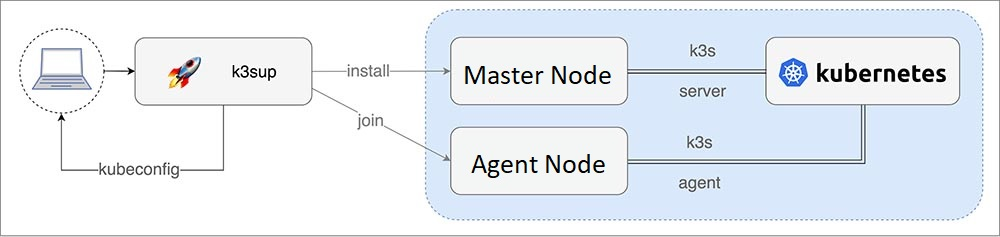

# K3s cluster setup using k3sup

k3sup (pronounced **ketchup**) is a popular open source tool to install K3s over
SSH.

- Bootstrap the cluster


The two most important commands in k3sup are:

i. install: install K3s to a new server and create a `join token` for the cluster

ii. join: fetch the `join token` from a server, then use it to install K3s to an
agent

## Download k3sup

```sh
curl -sLS https://get.k3sup.dev | sh
sudo install k3sup /usr/bin/

k3sup --help
```

- **Other options** for `install`:

    `--cluster` - start this server in clustering mode using embedded etcd (embedded
    HA)

    `--skip-install` - if you already have k3s installed, you can just run this command
    to get the kubeconfig

    `--ssh-key` - specify a specific path for the SSH key for remote login

    `--local-path` - default is `./kubeconfig` - set the file where you want to save
    your cluster's `kubeconfig`. By default this file will be overwritten.

    `--merge` - Merge config into existing file instead of overwriting (e.g. to add
    config to the default kubectl config, use `--local-path ~/.kube/config --merge`).

    `--context` - default is default - set the name of the kubeconfig context.

    `--ssh-port` - default is 22, but you can specify an alternative port i.e. `2222`

    `--k3s-extra-args` - Optional extra arguments to pass to k3s installer, wrapped
    in quotes, i.e. `--k3s-extra-args '--no-deploy traefik'` or
    `--k3s-extra-args '--docker'`. For multiple args combine then within single
    quotes `--k3s-extra-args`

    `--no-deploy traefik --docker`.

    `--k3s-version` - set the specific version of k3s, i.e. v0.9.1

    `--ipsec` - Enforces the optional extra argument for k3s: `--flannel-backend`
    option: `ipsec`

    `--print-command` - Prints out the command, sent over SSH to the remote computer

    `--datastore` - used to pass a SQL connection-string to the `--datastore-endpoint`
    flag of k3s.

    See even more install options by running `k3sup install --help`.

- On *Master* Node:

    ```sh
    export SERVER_IP=<Master-Internal-IP>
    export USER=root

    k3sup install --ip $SERVER_IP --user $USER
    ```

- On *Agent* Node:
Next join one or more `agents` to the cluster:

    ```sh
    export AGENT_IP=<Agent-Internal-IP>

    export SERVER_IP=<Master-Internal-IP>
    export USER=root

    k3sup join --ip $AGENT_IP --server-ip $SERVER_IP --user $USER
    ```

## Create a multi-master (HA) setup with external SQL

```sh
export LB_IP='<Loadbalancer-Internal-IP_or_Hostname>'
export DATASTORE='mysql://<YOUR_DB_USER_NAME>:<YOUR_DB_USER_PASSWORD>@tcp(<MySQL-Server-Internal-IP>:3306)/<YOUR_DB_NAME>'
export CHANNEL=latest
```

Before continuing, check that your environment variables are still populated from
earlier, and if not, trace back and populate them.

```sh
echo $LB_IP
echo $DATASTORE
echo $CHANNEL
```

```sh
k3sup install --user root --ip $SERVER1 \
--k3s-channel $CHANNEL \
--print-command \
--datastore='${DATASTORE}' \
--tls-san $LB_IP

k3sup install --user root --ip $SERVER2 \
--k3s-channel $CHANNEL \
--print-command \
--datastore='${DATASTORE}' \
--tls-san $LB_IP

k3sup install --user root --ip $SERVER3 \
--k3s-channel $CHANNEL \
--print-command \
--datastore='${DATASTORE}' \
--tls-san $LB_IP

k3sup join --user root --server-ip $LB_IP --ip $AGENT1 \
--k3s-channel $CHANNEL \
--print-command

k3sup join --user root --server-ip $LB_IP --ip $AGENT2 \
--k3s-channel $CHANNEL \
--print-command
```

---

There will be a kubeconfig file created in the current working directory with the
IP address of the LoadBalancer set for kubectl to use.

- Check the nodes have joined:

    ```sh
    export KUBECONFIG=`pwd`/kubeconfig
    kubectl get node
    ```

---
