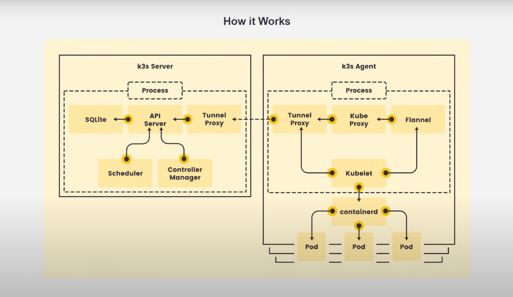
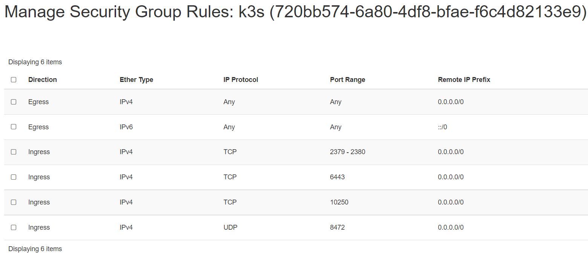

# K3s

## Features

- Lightweight certified K8s distro
- Built for production operations
- 40MB binary, 250MB memeory consumption
- Single process w/ integrated K8s master, Kubelet, and containerd
- Supports not only `etcd` to hold the cluster state, but also `SQLite`
(for single-node, simpler setups) or external DBs like `MySQL` and `PostgreSQL`
- Open source project

## Components and architecure



- High-Availability K3s Server with an External DB:

 or,


For this kind of high availability k3s setup [read this](k3s-ha-cluster.md).

## Pre-requisite

We will need 1 control-plane(master) and 2 worker nodes to create a single
control-plane kubernetes cluster using `k3s`. We are using following setting
for this purpose:

- 1 Linux machine for master, ubuntu-22.04-x86_64 or your choice of Ubuntu OS image,
cpu-a.2 flavor with 2vCPU, 4GB RAM, 20GB storage - also [assign Floating IP](../../../openstack/../openstack/create-and-connect-to-the-VM/assign-a-floating-IP.md)
 to the master node.
- 2 Linux machines for worker, ubuntu-22.04-x86_64 or your choice of Ubuntu OS image,
cpu-a.1 flavor with 1vCPU, 2GB RAM, 20GB storage.
- ssh access to all machines: [Read more here](../../../openstack/../openstack/create-and-connect-to-the-VM/bastion-host-based-ssh/index.md)
on how to setup SSH to your remote VMs.

## Networking

The K3s server needs port **6443** to be accessible by all nodes.

The nodes need to be able to reach other nodes over **UDP** port **8472** when **Flannel**
VXLAN overlay networking is used. The node should not listen on any other port. K3s
uses reverse tunneling such that the nodes make outbound connections to the server
and all kubelet traffic runs through that tunnel. However, if you do not use Flannel
and provide your own custom CNI, then port **8472** is not needed by K3s.

If you wish to utilize the **metrics server**, you will need to open port **10250**
on each node.

If you plan on achieving high availability with **embedded etcd**, server nodes
must be accessible to each other on ports **2379** and **2380**.

- Create 1 security group with appropriate [Inbound Rules for K3s Server Nodes](https://rancher.com/docs/k3s/latest/en/installation/installation-requirements/#networking)
that will be used by all 3 nodes:

    

!!! note "Important Note"
    The VXLAN overlay networking port on nodes should not be exposed to the world
    as it opens up your cluster network to be accessed by anyone. Run your nodes
    behind a firewall/security group that disables access to port **8472**.

- setup Unique hostname to each machine using the following command:

```sh
echo "<node_internal_IP> <host_name>" >> /etc/hosts
hostnamectl set-hostname <host_name>
```

For example,

```sh
echo "192.168.0.235 k3s-master" >> /etc/hosts
hostnamectl set-hostname k3s-master
```

In this step, you will steup the following nodes

- k3s-master
- k3s-worker1
- k3s-worker2

The below steps will be performed on all the above mentioned nodes:

- SSH into all the 3 machines

- Switch as root: `sudo su`

- Update the repositories and packages:

```sh
apt-get update && apt-get upgrade -y
```

- Install `curl` and `apt-transport-https`

```sh
apt-get update && apt-get install -y apt-transport-https curl
```

---

## Install **Docker**

- Install container runtime - **docker**

```sh
apt-get install docker.io -y
```

- Configure the Docker daemon, in particular to use systemd for the management
of the container’s cgroups

```sh
cat <<EOF | sudo tee /etc/docker/daemon.json
{
"exec-opts": ["native.cgroupdriver=systemd"]
}
EOF

systemctl enable --now docker
usermod -aG docker ubuntu
systemctl daemon-reload
systemctl restart docker
```

---

## Configure K3s to bootstrap the cluster on master node

Run the below command on the master node i.e. `k3s-master` that you want to setup
as control plane.

- SSH into **k3s-master** machine
- Switch to root user: `sudo su`
- Execute the below command to initialize the cluster:

```sh
curl -sfL https://get.k3s.io | sh -s - --kubelet-arg 'cgroup-driver=systemd' \
--node-taint CriticalAddonsOnly=true:NoExecute --docker
```

**OR,**
If you don't want to setup the K3s cluster without using  **docker** as the
container runtime, then just run without supplying the `--docker` argument.

```sh
curl -sfL https://get.k3s.io | sh -
```

After running this installation:

- The K3s service will be configured to automatically restart after node reboots
or if the process crashes or is killed
- Additional utilities will be installed, including `kubectl`, `crictl`, `ctr`,
`k3s-killall.sh`, and `k3s-uninstall.sh`
- A kubeconfig file will be written to `/etc/rancher/k3s/k3s.yaml` and the `kubectl`
installed by K3s will automatically use it.

To check if the service installed successfully, you can use:

```sh
systemctl status k3s
```

The output looks like:


**OR,**

```sh
k3s --version
kubectl version
```

!!! note "Note"
    If you want to taint the node i.e. not to deploy pods on this node after
    installation then run: `kubectl taint nodes <master_node_name> k3s-controlplane=true:NoExecute`
    i.e. `kubectl taint nodes k3s-master k3s-controlplane=true:NoExecute`

You can check if the master node is working by:

```sh
k3s kubectl get nodes

NAME         STATUS   ROLES                  AGE   VERSION
k3s-master   Ready    control-plane,master   37s   v1.21.5+k3s2
```

```sh
kubectl config get-clusters

NAME
default
```

```sh
kubectl cluster-info

Kubernetes control plane is running at https://127.0.0.1:6443
CoreDNS is running at https://127.0.0.1:6443/api/v1/namespaces/kube-system/services/kube-dns:dns/proxy
Metrics-server is running at https://127.0.0.1:6443/api/v1/namespaces/kube-system/services/https:metrics-server:/proxy

To further debug and diagnose cluster problems, use 'kubectl cluster-info dump'.
```

```sh
kubectl get namespaces

NAME              STATUS   AGE
default           Active   27m
kube-system       Active   27m
kube-public       Active   27m
kube-node-lease   Active   27m
```

```sh
kubectl get endpoints -n kube-system

NAME                    ENDPOINTS                                  AGE
kube-dns                10.42.0.4:53,10.42.0.4:53,10.42.0.4:9153   27m
metrics-server          10.42.0.3:443                              27m
rancher.io-local-path   <none>                                     27m
```

```sh
kubectl get pods -n kube-system

NAME                                      READY   STATUS    RESTARTS   AGE
helm-install-traefik-crd-ql7j2            0/1     Pending   0          32m
helm-install-traefik-mr65j                0/1     Pending   0          32m
coredns-7448499f4d-x57z7                  1/1     Running   0          32m
metrics-server-86cbb8457f-cg2fs           1/1     Running   0          32m
local-path-provisioner-5ff76fc89d-kdfcl   1/1     Running   0          32m
```

You need to extract a token form the master that will be used to join the nodes
to the master.

On the master node:

```sh
sudo cat /var/lib/rancher/k3s/server/node-token
```

You will then obtain a token that looks like:

```sh
K1097aace305b0c1077fc854547f34a598d23330ff047ddeed8beb3c428b38a1ca7::server:6cc9fbb6c5c9de96f37fb14b5535c778
```

---

## Configure K3s on worker nodes to join the cluster

Run the below command on both of the worker nodes i.e. `k3s-worker1` and `k3s-worker2`
that you want to join the cluster.

- SSH into **k3s-worker1** and **k3s-worker1** machine
- Switch to root user: `sudo su`
- Execute the below command to join the cluster using the token obtained from
the master node:

To install K3s on worker nodes and add them to the cluster, run the installation
script with the `K3S_URL` and `K3S_TOKEN` environment variables. Here is an example
showing how to join a worker node:

```sh
curl -sfL https://get.k3s.io | K3S_URL=https://<Master_IP>:6443 \
K3S_TOKEN=<Join_Token> sh -
```

Where <Master_IP> is the Internal IP of the master node and <Join_Token>  is the
token obtained from the master node.

For example,

```sh
curl -sfL https://get.k3s.io | K3S_URL=https://192.168.0.154:6443 \
K3S_TOKEN=K1019827f88b77cc5e1dce04d692d445c1015a578dafdc56aca829b2f
501df9359a::server:1bf0d61c85c6dac6d5a0081da55f44ba sh -
```

You can verify if the `k3s-agent` on both of the worker nodes is running by:

```sh
systemctl status k3s-agent
```

The output looks like:


---

To verify that our nodes have successfully been added to the cluster, run the
following command on master node:

```sh
k3s kubectl get nodes
```

**OR,**

```sh
k3s kubectl get nodes -o wide
```

Your output should look like:

```sh
k3s kubectl get nodes

NAME          STATUS   ROLES                  AGE     VERSION
k3s-worker1   Ready    <none>                 5m16s   v1.21.5+k3s2
k3s-worker2   Ready    <none>                 5m5s    v1.21.5+k3s2
k3s-master    Ready    control-plane,master   9m33s   v1.21.5+k3s2
```

This shows that we have successfully setup our K3s cluster ready to deploy applications
to it.

---

## Deploying Nginx using deployment

- Create a deployment `nginx.yaml` on master node

```sh
vi nginx.yaml
```

The **nginx.yaml** looks like this:

```sh
apiVersion: apps/v1
kind: Deployment
metadata:
  name: mysite
  labels:
    app: mysite
spec:
  replicas: 1
  selector:
    matchLabels:
      app: mysite
  template:
    metadata:
      labels:
        app : mysite
    spec:
      containers:
        - name : mysite
          image: nginx
          ports:
            - containerPort: 80
```

```sh
kubectl apply -f nginx.yaml
```

- Verify the nginx pod is on **Running** state:

```sh
sudo k3s kubectl get pods --all-namespaces
```

- Scale the pods to available agents:

```sh
sudo k3s kubectl scale --replicas=2 deploy/mysite
```

- View all deployment status:

```sh
sudo k3s kubectl get deploy mysite

NAME     READY   UP-TO-DATE   AVAILABLE   AGE
mysite   2/2     2            2           85s
```

- Delete the nginx deployment and pod:

```sh
sudo k3s kubectl delete -f nginx.yaml
```

**OR,**

```sh
sudo k3s kubectl delete deploy mysite
```

!!!node "Note"
    Instead of apply manually any new deployment yaml, you can just copy the *yaml*
    file to the **/var/lib/rancher/k3s/server/manifests/** folder
    i.e. `sudo cp nginx.yaml /var/lib/rancher/k3s/server/manifests/.`. This will
    automatically deploy the newly copied deployment on your cluster.

## Deploy Addons to K3s

K3s is a lightweight kubernetes tool that doesn’t come packaged with all the tools
but you can install them separately.

- Install **Helm** Commandline tool on K3s:

i. Download the latest version of Helm commandline tool using `wget` from [this page](https://github.com/helm/helm/releases).

```sh
wget https://get.helm.sh/helm-v3.7.0-linux-amd64.tar.gz
```

ii. Unpack it:

```sh
tar -zxvf helm-v3.7.0-linux-amd64.tar.gz
```

iii. Find the helm binary in the unpacked directory, and move it to its desired destination

```sh
mv linux-amd64/helm /usr/bin/helm
chmod +x /usr/bin/helm
```

**OR,**

Using Snap:

```sh
snap install helm --classic
```

**OR,**

Using Apt (Debian/Ubuntu):

```sh
curl https://baltocdn.com/helm/signing.asc | sudo apt-key add -
sudo apt-get install apt-transport-https --yes
echo "deb https://baltocdn.com/helm/stable/debian/ all main" | sudo tee /etc/apt/sources.list.d/helm-stable-debian.list
sudo apt-get update
sudo apt-get install helm
```

- Verify the `Helm` installation:

```sh
helm version

version.BuildInfo{Version:"v3.7.0", GitCommit:"eeac83883cb4014fe60267ec63735
70374ce770b", GitTreeState:"clean", GoVersion:"go1.16.8"}
```

- Add the helm chart repository to allow installation of applications using helm:

```sh
helm repo add stable https://charts.helm.sh/stable
helm repo update
```

---

## Deploy A Sample Nginx Application using **Helm**

**Nginx** can be used as a web proxy to expose [ingress](https://github.com/kubernetes/ingress-nginx/tree/main/charts/ingress-nginx)
web traffic routes in and out of the cluster.

- You can install "nginx web-proxy" using Helm:

```sh
export KUBECONFIG=/etc/rancher/k3s/k3s.yaml
helm repo add ingress-nginx https://kubernetes.github.io/ingress-nginx
helm repo list
helm repo update
helm install stable ingress-nginx/ingress-nginx --namespace kube-system \
    --set defaultBackend.enabled=false --set controller.publishService.enabled=true
```

- We can test if the application has been installed by:

```sh
k3s kubectl get pods -n kube-system -l app=nginx-ingress -o wide

NAME   READY STATUS  RESTARTS AGE  IP        NODE    NOMINATED NODE  READINESS GATES
nginx.. 1/1  Running 0        19m  10.42.1.5 k3s-worker1   <none>      <none>
```

- We have successfully deployed nginx web-proxy on k3s. Go to browser, visit `http://<Master-Floating-IP>`
i.e. <http://128.31.25.246> to check the nginx default page.

## Upgrade K3s Using the Installation Script

To upgrade K3s from an older version you can re-run the installation script using
the same flags, for example:

```sh
curl -sfL https://get.k3s.io | sh -
```

This will upgrade to a newer version in the stable channel by default.

If you want to upgrade to a newer version in a specific channel (such as latest)
you can specify the channel:

```sh
curl -sfL https://get.k3s.io | INSTALL_K3S_CHANNEL=latest sh -
```

If you want to upgrade to a specific version you can run the following command:

```sh
curl -sfL https://get.k3s.io | INSTALL_K3S_VERSION=vX.Y.Z-rc1 sh -
```

From non root user's terminal to install the latest version, you do not need to
pass `INSTALL_K3S_VERSION` that by **default** loads **the Latest version**.

```sh
curl -sfL https://get.k3s.io | INSTALL_K3S_EXEC="--write-kubeconfig-mode 644" \
    sh -
```

!!! note "Note"
    For more about on **"How to use flags and environment variables"** [read this](https://rancher.com/docs/k3s/latest/en/installation/install-options/how-to-flags/).

## Restarting K3s

Restarting K3s is supported by the installation script for `systemd` and `OpenRC`.

Using **systemd**:

To restart servers manually:

```sh
sudo systemctl restart k3s
```

To restart agents manually:

```sh
sudo systemctl restart k3s-agent
```

Using **OpenRC**:

To restart servers manually:

```sh
sudo service k3s restart
```

To restart agents manually:

```sh
sudo service k3s-agent restart
```

## Uninstalling

If you installed `K3s` with the help of the `install.sh` script, an uninstall script
is generated during installation. The script is created on your master node at
`/usr/bin/k3s-uninstall.sh` or as `k3s-agent-uninstall.sh` on your worker nodes.

To remove K3s on the worker nodes, execute:

```sh
sudo /usr/bin/k3s-agent-uninstall.sh
sudo rm -rf /var/lib/rancher
```

To remove k3s on the master node, execute:

```sh
sudo /usr/bin/k3s-uninstall.sh
sudo rm -rf /var/lib/rancher
```

---
