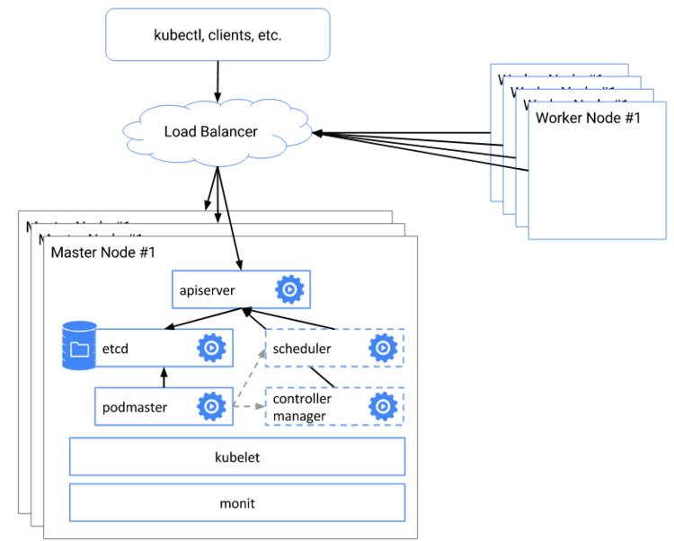
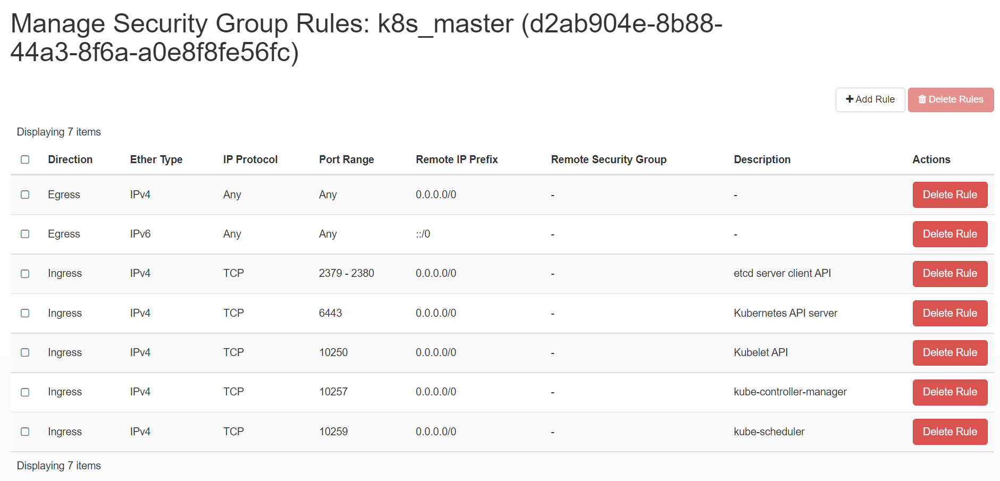
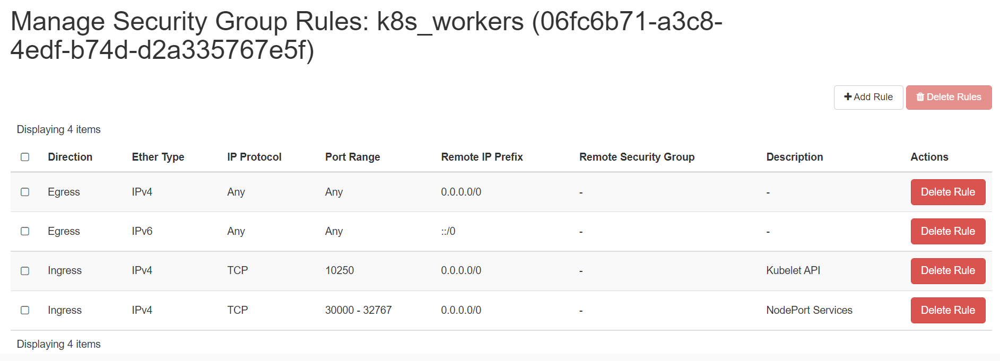
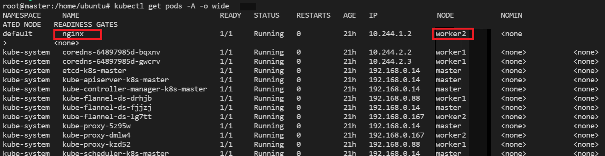

# Highly Available Kubernetes Cluster using kubeadm

## Objectives

- Install a multi control-plane(master) Kubernetes cluster
- Install a Pod network on the cluster so that your Pods can talk to each other
- Deploy and test a sample app
- Deploy K8s Dashboard to view all cluster's components

## Components and architecure

This shows components and architecture of a highly-available, production-grade
Kubernetes cluster.



You can learn about each component from [Kubernetes Componets](https://kubernetes.io/docs/concepts/overview/components/).

## Pre-requisite

You will need 2 control-plane(master node) and 2 worker nodes to create a
multi-master kubernetes cluster using `kubeadm`. You are going to use the
following set up for this purpose:

- 2 Linux machines for master, ubuntu-20.04-x86_64 or your choice of Ubuntu OS image,
cpu-su.2 flavor with 2vCPU, 8GB RAM, 40GB storage.
- 2 Linux machines for worker, ubuntu-20.04-x86_64 or your choice of Ubuntu OS image,
cpu-su.1 flavor with 1vCPU, 4GB RAM, 20GB storage - also [assign Floating IPs](../../../openstack/create-and-connect-to-the-VM/assign-a-floating-IP.md)
 to both of the worker nodes.
- 1 Linux machine for loadbalancer, ubuntu-20.04-x86_64 or your choice of Ubuntu
OS image, cpu-su.1 flavor with 1vCPU, 4GB RAM, 20GB storage.
- ssh access to all machines:  [Read more here](../../../openstack/create-and-connect-to-the-VM/bastion-host-based-ssh/index.md)
on how to setup SSH to your remote VMs.
- Create 2 security groups with appropriate [ports and protocols](https://kubernetes.io/docs/reference/ports-and-protocols/):

    i. To be used by the master nodes:
    

    ii. To be used by the worker nodes:
    

- setup Unique hostname to each machine using the following command:

```sh
echo "<node_internal_IP> <host_name>" >> /etc/hosts
hostnamectl set-hostname <host_name>
```

For example,

```sh
echo "192.168.0.167 loadbalancer" >> /etc/hosts
hostnamectl set-hostname loadbalancer
```

## Steps

1. Prepare the Loadbalancer node to communicate with the two master nodes'
apiservers on their IPs via port 6443.
2. Do following in all the nodes except the Loadbalancer node:
    - Disable swap.
    - Install `kubelet` and `kubeadm`.
    - Install container runtime - you will be using *`containerd`*.
3. Initiate `kubeadm` control plane configuration on one of the master nodes.
4. Save the new master and worker node join commands with the token.
5. Join the second master node to the control plane using the join command.
6. Join the worker nodes to the control plane using the join command.
7. Configure kubeconfig(`$HOME/.kube/config`) on loadbalancer node.
8. Install `kubectl` on Loadbalancer node.
9. Install CNI network plugin i.e. **Flannel** on Loadbalancer node.
10. Validate all cluster components and nodes are visible on Loadbalancer node.
11. Deploy a sample app and validate the app from Loadbalancer node.

---

## Setting up loadbalancer

You will use **HAPROXY** as the primary loadbalancer, but you can use any other
options as well. This node will be not part of the K8s cluster but will be
outside of the cluster and interacts with the cluster using ports.

You have 2 master nodes. Which means the user can connect to either of the 2
apiservers. The loadbalancer will be used to loadbalance between the 2 apiservers.

- Login to the loadbalancer node

- Switch as root - `sudo su`

- Update your repository and your system

```sh
sudo apt-get update && sudo apt-get upgrade -y

```

- Install haproxy

```sh
sudo apt-get install haproxy -y
```

- Edit haproxy configuration

```sh
vi /etc/haproxy/haproxy.cfg
```

Add the below lines to create a frontend configuration for loadbalancer -

```sh
frontend fe-apiserver
   bind 0.0.0.0:6443
   mode tcp
   option tcplog
   default_backend be-apiserver
```

Add the below lines to create a backend configuration for master1 and master2
nodes at port **6443**.

!!! note "Note"
    6443 is the default port of **kube-apiserver**

```sh
backend be-apiserver
   mode tcp
   option tcplog
   option tcp-check
   balance roundrobin
   default-server inter 10s downinter 5s rise 2 fall 2 slowstart 60s maxconn 250 maxqueue 256 weight 100 #<!-- markdownlint-disable -->

       server master1 10.138.0.15:6443 check
       server master2 10.138.0.16:6443 check
```

Here - **master1** and **master2** are the hostnames of the master nodes and
**10.138.0.15** and **10.138.0.16** are the corresponding internal IP addresses.

- Ensure haproxy config file is correctly formatted:

```sh
haproxy -c -q -V -f /etc/haproxy/haproxy.cfg
```

- Restart and Verify haproxy

```sh
systemctl restart haproxy
systemctl status haproxy
```

Ensure haproxy is in running status.

Run `nc` command as below:

```sh
nc -v localhost 6443
Connection to localhost 6443 port [tcp/*] succeeded!
```

!!! note "Note"
    If you see failures for `master1` and `master2` connectivity, you can ignore
    them for time being as you have not yet installed anything on the servers.

---

## Install kubeadm, kubelet and containerd on master and worker nodes

`kubeadm` will not install or manage `kubelet` or `kubectl` for you, so you will
need to ensure they match the version of the Kubernetes control plane you want kubeadm
to install for you. You will install these packages on all of your machines:

• **kubeadm**: the command to bootstrap the cluster.

• **kubelet**: the component that runs on all of the machines in your cluster and
does things like starting pods and containers.

• **kubectl**: the command line util to talk to your cluster.

In this step, you will install kubelet and kubeadm on the below nodes

- master1
- master2
- worker1
- worker2

The below steps will be performed on all the above mentioned nodes:

- SSH into all the 4 machines

- Switch as root: `sudo su`

- Update the repositories and packages:

```sh
apt-get update && apt-get upgrade -y
```

- Turn off `swap`

```sh
swapoff -a
sed -i '/ swap / s/^/#/' /etc/fstab
```

- Install `curl` and `apt-transport-https`

```sh
apt-get update && apt-get install -y apt-transport-https curl
```

- Download the Google Cloud public signing key and add key to verify releases

```sh
curl -s https://packages.cloud.google.com/apt/doc/apt-key.gpg | apt-key add -
```

- add kubernetes apt repo

```sh
cat <<EOF | sudo tee /etc/apt/sources.list.d/kubernetes.list
deb https://apt.kubernetes.io/ kubernetes-xenial main
EOF
```

- Install kubelet and kubeadm

```sh
apt-get update
apt-get install -y kubelet kubeadm
```

- `apt-mark hold` is used so that these packages will not be updated/removed automatically

```sh
apt-mark hold kubelet kubeadm
```

---

## Install the **container runtime** i.e. **containerd** on master and worker nodes

To run containers in Pods, Kubernetes uses a [container runtime](https://kubernetes.io/docs/setup/production-environment/container-runtimes/).

By default, Kubernetes uses the **Container Runtime Interface (CRI)** to interface
with your chosen container runtime.

- Install container runtime - **containerd**

The first thing to do is configure the persistent loading of the necessary
`containerd` modules. This forwarding IPv4 and letting iptables see bridged
trafficis is done with the following command:

```sh
cat <<EOF | sudo tee /etc/modules-load.d/k8s.conf
overlay
br_netfilter
EOF

sudo modprobe overlay
sudo modprobe br_netfilter
```

- Ensure `net.bridge.bridge-nf-call-iptables` is set to `1` in your sysctl config:

```sh
# sysctl params required by setup, params persist across reboots
cat <<EOF | sudo tee /etc/sysctl.d/k8s.conf
net.bridge.bridge-nf-call-iptables  = 1
net.bridge.bridge-nf-call-ip6tables = 1
net.ipv4.ip_forward                 = 1
EOF
```

- Apply sysctl params without reboot:

```sh
sudo sysctl --system
```

- Install the necessary dependencies with:

```sh
sudo apt install -y curl gnupg2 software-properties-common apt-transport-https ca-certificates
```

- The `containerd.io` packages in DEB and RPM formats are distributed by Docker.
Add the required GPG key with:

```sh
curl -fsSL https://download.docker.com/linux/ubuntu/gpg | sudo apt-key add -
sudo add-apt-repository "deb [arch=amd64] https://download.docker.com/linux/ubuntu $(lsb_release -cs) stable"
```

It's now time to Install and configure containerd:

```sh
sudo apt update -y
sudo apt install -y containerd.io
containerd config default | sudo tee /etc/containerd/config.toml

# Reload the systemd daemon with
sudo systemctl daemon-reload

# Start containerd
sudo systemctl restart containerd
sudo systemctl enable --now containerd
```

You can verify `containerd` is running with the command:

```sh
sudo systemctl status containerd
```

---

## Configure kubeadm to bootstrap the cluster

You will start off by initializing only one master node. For this purpose, you
choose `master1` to initialize our first control plane but you can also do the
same in `master2`.

- SSH into **master1** machine
- Switch to root user: `sudo su`

!!! danger "Configuring the kubelet cgroup driver"
    From 1.22 onwards, if you do not set the `cgroupDriver` field under
    `KubeletConfiguration`, `kubeadm` will default it to `systemd`. So you do
    not need to do anything here by default but if you want you change it you can
    refer to [this documentation](https://kubernetes.io/docs/tasks/administer-cluster/kubeadm/configure-cgroup-driver/).

- Execute the below command to initialize the cluster:

```sh
kubeadm config images pull
kubeadm init --control-plane-endpoint
"LOAD_BALANCER_IP_OR_HOSTNAME:LOAD_BALANCER_PORT" --upload-certs --pod-network-cidr=10.244.0.0/16
```

Here, you can use either the IP address or the hostname of the loadbalancer in
place of <LOAD_BALANCER_IP_OR_HOSTNAME>. You have not enabled the hostname of
the server, i.e. `loadbalancer` as the LOAD_BALANCER_IP_OR_HOSTNAME that is
visible from the **master1** node. so instead of using not resolvable hostnames
across your network, you will be using the IP address of the Loadbalancer server.

The <LOAD_BALANCER_PORT> is the front end configuration port defined in HAPROXY
configuration. For this, you have kept the port as **6443** which is the default
`apiserver` port.

!!! note "Important Note"
    `--pod-network-cidr` value depends upon what CNI plugin you going to use so
    need to be very careful while setting this CIDR values. In our case, you are
    going to use **Flannel** CNI network plugin so you will use:
    `--pod-network-cidr=10.244.0.0/16`. If you are opted to use **Calico** CNI
    network plugin then you need to use: `--pod-network-cidr=192.168.0.0/16` and
    if you are opted to use **Weave Net** no need to pass this parameter.

For example, our `Flannel` CNI network plugin based kubeadm init command with
*loadbalancer node* with internal IP: `192.168.0.167` look like below:

```sh
kubeadm config images pull
kubeadm init --control-plane-endpoint "192.168.0.167:6443" --upload-certs --pod-network-cidr=10.244.0.0/16
```

Save the output in some secure file for future use. This will show an unique token
to join the control plane. The output from `kubeadm init` should looks like below:

```sh
Your Kubernetes control-plane has initialized successfully!

To start using your cluster, you need to run the following as a regular user:

  mkdir -p $HOME/.kube
  sudo cp -i /etc/kubernetes/admin.conf $HOME/.kube/config
  sudo chown $(id -u):$(id -g) $HOME/.kube/config

Alternatively, if you are the root user, you can run:

  export KUBECONFIG=/etc/kubernetes/admin.conf

You should now deploy a pod network to the cluster.
Run "kubectl apply -f [podnetwork].yaml" with one of the options listed at:
  https://kubernetes.io/docs/concepts/cluster-administration/addons/

You can now join any number of the control-plane node running the following
command on each worker nodes as root:

  kubeadm join 192.168.0.167:6443 --token cnslau.kd5fjt96jeuzymzb \
    --discovery-token-ca-cert-hash sha256:871ab3f050bc9790c977daee9e44cf52e15ee3
    7ab9834567333b939458a5bfb5 \
    --control-plane --certificate-key 824d9a0e173a810416b4bca7038fb33b616108c17abcbc5eaef8651f11e3d146

Please note that the certificate-key gives access to cluster sensitive data, keep
it secret!
As a safeguard, uploaded-certs will be deleted in two hours; If necessary, you
can use "kubeadm init phase upload-certs --upload-certs" to reload certs afterward.

Then you can join any number of worker nodes by running the following on each as
root:

kubeadm join 192.168.0.167:6443 --token cnslau.kd5fjt96jeuzymzb \
    --discovery-token-ca-cert-hash sha256:871ab3f050bc9790c977daee9e44cf52e15ee37ab9834567333b939458a5bfb5
```

The output consists of 3 major tasks:

A. Setup `kubeconfig` using on current master node:
As you are running as `root` user so you need to run the following command:

```sh
export KUBECONFIG=/etc/kubernetes/admin.conf
```

We need to run the below commands as a normal user to use the kubectl from terminal.

```sh
mkdir -p $HOME/.kube
sudo cp -i /etc/kubernetes/admin.conf $HOME/.kube/config
sudo chown $(id -u):$(id -g) $HOME/.kube/config
```

Now the machine is initialized as master.

!!! warning "Warning"
    Kubeadm signs the certificate in the admin.conf to have
    `Subject: O = system:masters, CN = kubernetes-admin. system:masters` is a
    break-glass, super user group that bypasses the authorization layer
    (e.g. RBAC). Do not share the admin.conf file with anyone and instead
    grant users custom permissions by generating them a kubeconfig file using
    the `kubeadm kubeconfig user` command.

B. Setup a new control plane (master) i.e. `master2` by running following
command on **master2** node:

```sh
kubeadm join 192.168.0.167:6443 --token cnslau.kd5fjt96jeuzymzb \
    --discovery-token-ca-cert-hash sha256:871ab3f050bc9790c977daee9e44cf52e1
        5ee37ab9834567333b939458a5bfb5 \
    --control-plane --certificate-key 824d9a0e173a810416b4bca7038fb33b616108c17abcbc5eaef8651f11e3d146
```

C. Join worker nodes running following command on individual worker nodes:

```sh
kubeadm join 192.168.0.167:6443 --token cnslau.kd5fjt96jeuzymzb \
    --discovery-token-ca-cert-hash sha256:871ab3f050bc9790c977daee9e44cf52e15ee37ab9834567333b939458a5bfb5
```

!!! note "Important Note"
    **Your output will be different than what is provided here. While
    performing the rest of the demo, ensure that you are executing the
    command provided by your output and dont copy and paste from here.**

If you do not have the token, you can get it by running the following command on
the control-plane node:

```sh
kubeadm token list
```

The output is similar to this:

```sh
TOKEN     TTL  EXPIRES      USAGES           DESCRIPTION            EXTRA GROUPS
8ewj1p... 23h  2018-06-12   authentication,  The default bootstrap  system:
                            signing          token generated by     bootstrappers:
                                            'kubeadm init'.         kubeadm:
                                                                    default-node-token
```

If you missed the join command, execute the following command
`kubeadm token create --print-join-command` in the master node to recreate the
token with the join command.

```sh
root@master:~$ kubeadm token create --print-join-command

kubeadm join 10.2.0.4:6443 --token xyzeyi.wxer3eg9vj8hcpp2 \
--discovery-token-ca-cert-hash sha256:ccfc92b2a31b002c3151cdbab77ff4dc32ef13b213fa3a9876e126831c76f7fa
```

By default, tokens expire after 24 hours. If you are joining a node to the cluster
after the current token has expired, you can create a new token by running the
following command on the control-plane node:

```sh
kubeadm token create
```

The output is similar to this:
`5didvk.d09sbcov8ph2amjw`

We can use this new token to join:

```sh
$ kubeadm join <master-ip>:<master-port> --token <token> \
    --discovery-token-ca-cert-hash sha256:<hash>
```

---

- SSH into `master2`
- Switch to root user:`sudo su`
- Check the command provided by the output of `master1`:

You can now use the below command to add another control-plane node(master) to
the control plane:

```sh
kubeadm join 192.168.0.167:6443 --token cnslau.kd5fjt96jeuzymzb
    --discovery-token-ca-cert-hash sha256:871ab3f050bc9790c977daee9e44cf52e15ee3
    7ab9834567333b939458a5bfb5 \
    --control-plane --certificate-key 824d9a0e173a810416b4bca7038fb33b616108c17abcbc5eaef8651f11e3d146

```

- Execute the kubeadm join command for control plane on `master2`

Your output should look like:

```sh
 This node has joined the cluster and a new control plane instance was created:

* Certificate signing request was sent to apiserver and approval was received.
* The Kubelet was informed of the new secure connection details.
* Control plane (master) label and taint were applied to the new node.
* The Kubernetes control plane instances scaled up.
* A new etcd member was added to the local/stacked etcd cluster.

```

Now that you have initialized both the masters - you can now work on
bootstrapping the worker nodes.

- SSH into **worker1** and **worker2**
- Switch to root user on both the machines: `sudo su`
- Check the output given by the init command on **master1** to join worker node:

```sh
kubeadm join 192.168.0.167:6443 --token cnslau.kd5fjt96jeuzymzb \
    --discovery-token-ca-cert-hash sha256:871ab3f050bc9790c977daee9e44cf52e15ee37ab9834567333b939458a5bfb5
```

- Execute the above command on both the nodes:

- Your output should look like:

```sh
This node has joined the cluster:
* Certificate signing request was sent to apiserver and a response was received.
* The Kubelet was informed of the new secure connection details.

```

---

## Configure kubeconfig on loadbalancer node

Now that you have configured the master and the worker nodes, its now time to
configure Kubeconfig (`.kube`) on the loadbalancer node. It is completely up to
you if you want to use the loadbalancer node to setup kubeconfig. kubeconfig can
also be setup externally on a separate machine which has access to loadbalancer
node. For the purpose of this demo you will use loadbalancer node to host
kubeconfig and `kubectl`.

- SSH into `loadbalancer` node
- Switch to root user: `sudo su`
- Create a directory: .kube at $HOME of root user

```sh
mkdir -p $HOME/.kube
```

- SCP configuration file from any one **master** node to **loadbalancer** node

```sh
scp master1:/etc/kubernetes/admin.conf $HOME/.kube/config

```

!!! note "Important Note"
    If you havent setup ssh connection between master node and loadbalancer, you
    can manually copy content of the file `/etc/kubernetes/admin.conf` from
    `master1` node and then paste it to `$HOME/.kube/config` file on the
    loadbalancer node. Ensure that the kubeconfig file path is
    **`$HOME/.kube/config`** on the loadbalancer node.

- Provide appropriate ownership to the copied file

```sh
chown $(id -u):$(id -g) $HOME/.kube/config
```

---

## Install **kubectl**

- Install kubectl binary

    • **kubectl**: the command line util to talk to your cluster.

```sh
snap install kubectl --classic
```

This outputs: `kubectl 1.26.1 from Canonical✓ installed`

- Verify the cluster

```sh
kubectl get nodes

NAME      STATUS        ROLES                  AGE     VERSION
master1   NotReady      control-plane,master   21m     v1.26.1
master2   NotReady      control-plane,master   15m     v1.26.1
worker1   Ready         <none>                 9m17s   v1.26.1
worker2   Ready         <none>                 9m25s   v1.26.1

```

---

## Install CNI network plugin

### CNI overview

Managing a network where containers can interoperate efficiently is very
important. Kubernetes has adopted the Container Network Interface(CNI)
specification for managing network resources on a cluster. This relatively
simple specification makes it easy for Kubernetes to interact with a wide range
of CNI-based software solutions. Using this CNI plugin allows Kubernetes pods to
have the same IP address inside the pod as they do on the VPC network. Make sure
the configuration corresponds to the Pod CIDR specified in the `kubeadm`
configuration file if applicable.

You must deploy a CNI based Pod network add-on so that your Pods can communicate
with each other. Cluster DNS (CoreDNS) will not start up before a network is
installed. To verify you can run this command: `kubectl get po -n kube-system`:

You should see the following output. You will see the two `coredns-*` pods in a
pending state. It is the expected behavior. Once we install the network plugin,
it will be in a Running state.

Output Example:

```sh
root@loadbalancer:~$ kubectl get po -n kube-system
 NAME                               READY  STATUS   RESTARTS  AGE
coredns-558bd4d5db-5jktc             0/1   Pending   0        10m
coredns-558bd4d5db-xdc5x             0/1   Pending   0        10m
etcd-master1                         1/1   Running   0        11m
kube-apiserver-master1               1/1   Running   0        11m
kube-controller-manager-master1      1/1   Running   0        11m
kube-proxy-5jfh5                     1/1   Running   0        10m
kube-scheduler-master1               1/1   Running   0        11m
```

### Supported CNI options

To read more about the currently supported base CNI solutions for Kubernetes
[read here](https://kubernetes.io/docs/concepts/cluster-administration/networking/)
and also [read this](https://kubernetes.io/docs/setup/production-environment/tools/kubeadm/create-cluster-kubeadm/#pod-network).

The below command can be run on the Loadbalancer node to install the CNI plugin:

```sh
kubectl apply -f https://github.com/coreos/flannel/raw/master/Documentation/kube-flannel.yml
```

As you had passed `--pod-network-cidr=10.244.0.0/16` with `kubeadm init` so this
should work for **Flannel** CNI.

!!! tip "Using Other CNI Options"
    For **Calico** CNI plugin to work correctly, you need to pass
    `--pod-network-cidr=192.168.0.0/16` with `kubeadm init` and then you can run:
    `kubectl apply -f https://docs.projectcalico.org/v3.8/manifests/calico.yaml`
    ---
    For **Weave Net** CNI plugin to work correctly, you **don't** need to pass
    `--pod-network-cidr` with `kubeadm init` and then you can run:
    `kubectl apply -f "https://cloud.weave.works/k8s/net?k8s-version=$(kubectl
    version | base64 | tr -d '\n')"`

- Dual Network:
It is **highly recommended** to follow an internal/external network layout for your
cluster, as showed in this diagram:


To enable this just give two different names to the internal and external interface,
according to your distro of choiche naming scheme:

```sh
external_interface: eth0
internal_interface: eth1
```

Also you can decide here what CIDR should your cluster use

```sh
cluster_cidr: 10.43.0.0/16
service_cidr: 10.44.0.0/16
```

Once you successfully installed the **Flannel** CNI component to your cluster.
You can now verify your HA cluster running:

```sh
kubectl get nodes

NAME      STATUS   ROLES                    AGE   VERSION
master1   Ready    control-plane,master     22m   v1.26.1
master2   Ready    control-plane,master     17m   v1.26.1
worker1   Ready    <none>                   10m   v1.26.1
worker2   Ready    <none>                   10m   v1.26.1

```

---

## Deploy A Sample Nginx Application From one of the master nodes

Now that we have all the components to make the cluster and applications work,
let’s deploy a sample Nginx application and see if we can access it over a
[NodePort](https://kubernetes.io/docs/concepts/services-networking/service/#nodeport)
that has port range of *30000-32767*.

The below command can be run on:

```sh
kubectl run nginx --image=nginx --port=80
kubectl expose pod nginx --port=80 --type=NodePort
```

To check which NodePort is opened and running the Nginx run:

```sh
kubectl get svc
```

The output will show:


Once the deployment is up, you should be able to access the Nginx home page on
the allocated NodePort from either of the worker nodes' Floating IP.

To check which worker node is serving `nginx`, you can check **NODE** column
running the following command:

```sh
kubectl get pods --all-namespaces --output wide
```

**OR,**

```sh
kubectl get pods -A -o wide
```

This will show like below:



Go to browser, visit `http://<Worker-Floating-IP>:<NodePort>`
i.e. <http://128.31.25.246:32713> to check the nginx default page.
Here `Worker_Floating-IP` corresponds to the Floating IP of the `nginx` pod
running worker node i.e. `worker2`.

For your example,


---

## Deploy A K8s Dashboard

You will going to setup [K8dash/Skooner](https://github.com/skooner-k8s/skooner)
to view a dashboard that shows all your K8s cluster components.

- SSH into `loadbalancer` node
- Switch to root user: `sudo su`
- Apply available deployment by running the following command:

```sh
kubectl apply -f https://raw.githubusercontent.com/skooner-k8s/skooner/master/kubernetes-skooner-nodeport.yaml
```

This will map Skooner port **4654** to a randomly selected port on the running node.
The assigned NodePort can be found running:

```sh
kubectl get svc --namespace=kube-system
```

**OR,**

```sh
kubectl get po,svc -n kube-system
```


To check which worker node is serving `skooner-*`, you can check **NODE** column
running the following command:

```sh
kubectl get pods --all-namespaces --output wide
```

**OR,**

```sh
kubectl get pods -A -o wide
```

This will show like below:


Go to browser, visit `http://<Worker-Floating-IP>:<NodePort>` i.e.
<http://128.31.25.246:30495> to check the skooner dashboard page.
Here `Worker_Floating-IP` corresponds to the Floating IP of the `skooner-*` pod
running worker node i.e. `worker2`.


Setup the **Service Account Token** to access the Skooner Dashboard:

The first (and easiest) option is to create a dedicated service account. Run the
following commands:

- Create the service account in the current namespace (we assume default)

`kubectl create serviceaccount skooner-sa`

- Give that service account root on the cluster

`kubectl create clusterrolebinding skooner-sa --clusterrole=cluster-admin --serviceaccount=default:skooner-sa`

- Create a secret that was created to hold the token for the SA:

```sh
kubectl apply -f - <<EOF
apiVersion: v1
kind: Secret
metadata:
  name: skooner-sa-token
  annotations:
    kubernetes.io/service-account.name: skooner-sa
type: kubernetes.io/service-account-token
EOF
```

!!! info "Information"
    Since 1.22, this type of Secret is no longer used to mount credentials into
    Pods, and obtaining tokens via the [TokenRequest API](https://kubernetes.io/docs/reference/kubernetes-api/authentication-resources/token-request-v1/)
    is recommended instead of using service account token Secret objects. Tokens
    obtained from the *TokenRequest API* are more secure than ones stored in Secret
    objects, because they have a bounded lifetime and are not readable by other API
    clients. You can use the `kubectl create token` command to obtain a token from
    the TokenRequest API. For example: `kubectl create token skooner-sa`.

- Find the secret that was created to hold the token for the SA

`kubectl get secrets`

- Show the contents of the secret to extract the token

`kubectl describe secret skooner-sa-token`

Copy the **token** value from the secret detail and enter it into the login screen
to access the dashboard.

## Watch Demo Video showing how to setup the cluster

Here’s a [recorded demo video](https://drive.google.com/file/d/1mALftMHEUkjQ7lK6oJ6S_tiY59Q0JASY/view?usp=sharing)
on how to setup HA K8s cluster using `kubeadm` as
explained above.

---

## Very Important: Certificates Renewal

Client certificates generated by `kubeadm` expire after one year unless the
Kubernetes version is upgraded or the certificates are manually renewed.

To renew certificates manually, you can use the kubeadm certs renew command with
the appropriate command line options. After running the command, you should
restart the control plane Pods.

`kubeadm certs renew` can renew any specific certificate or, with the subcommand
all, it can renew all of them, as shown below:

```sh
kubeadm certs renew all
```

Once renewing certificates is done. You must restart the `kube-apiserver`,
`kube-controller-manager`, `kube-scheduler` and `etcd`, so that they can use the
new certificates by running:

```sh
systemctl restart kubelet
```

Then, update the new kube config file:

```sh
export KUBECONFIG=/etc/kubernetes/admin.conf
sudo cp -i /etc/kubernetes/admin.conf $HOME/.kube/config
```

!!! info "Don't Forget to Update the older kube config file"
    Update wherever you are using the older kube config to connect with the cluster.

## Clean Up

- To view the Cluster info:

```sh
kubectl cluster-info
```

- To delete your local references to the cluster:

```sh
kubectl config delete-cluster
```

### How to Remove the node?

Talking to the control-plane node with the appropriate credentials, run:

```sh
kubectl drain <node name> --delete-emptydir-data --force --ignore-daemonsets
```

- Before removing the node, reset the state installed by kubeadm:

```sh
kubeadm reset
```

The reset process does not reset or clean up iptables rules or IPVS tables. If
you wish to reset iptables, you must do so manually:

```sh
iptables -F && iptables -t nat -F && iptables -t mangle -F && iptables -X
```

If you want to reset the IPVS tables, you must run the following command:

```sh
ipvsadm -C
```

- Now remove the node:

```sh
kubectl delete node <node name>
```

If you wish to start over, run `kubeadm init` or `kubeadm join` with the
appropriate arguments.

---
