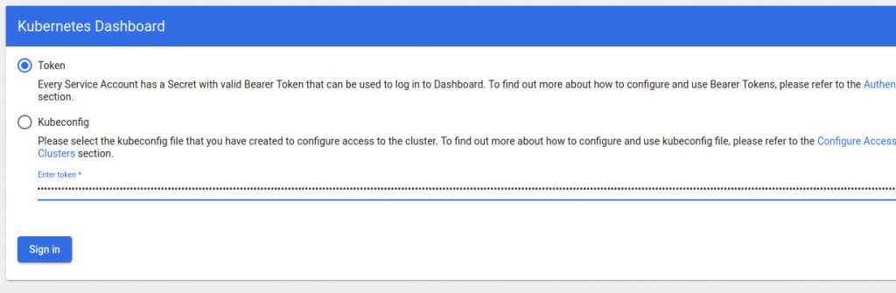
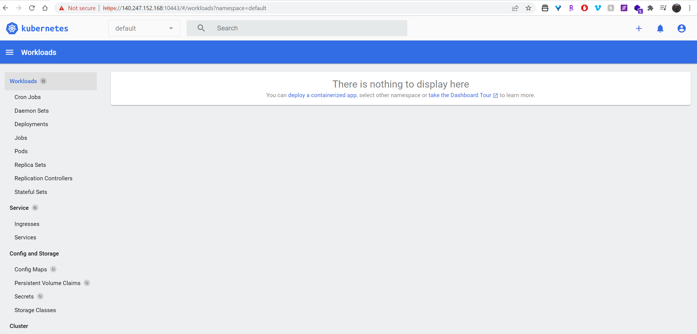
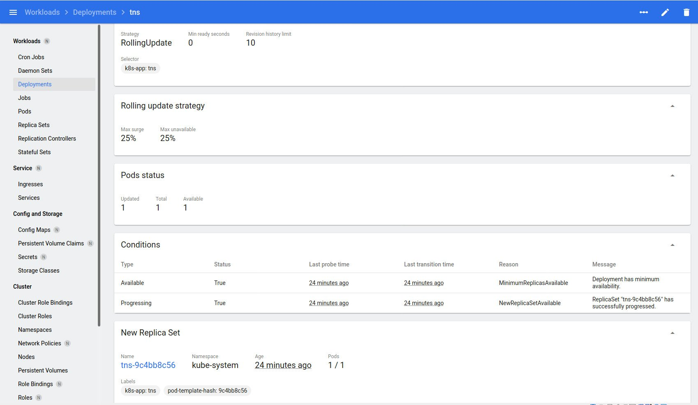
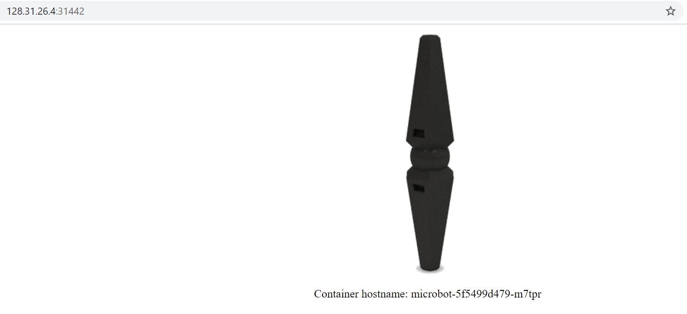

# Microk8s

## Pre-requisite

We will need 1 VM to create a single node kubernetes cluster using `microk8s`.
We are using following setting for this purpose:

- 1 Linux machine, `ubuntu-22.04-x86_64` or your choice of Ubuntu OS image,
  `cpu-su.2` flavor with 2vCPU, 8GB RAM, 20GB storage - also [assign Floating IP](../../openstack/create-and-connect-to-the-VM/assign-a-floating-IP.md)
  to this VM.

- setup Unique hostname to the machine using the following command:

    ```sh
    echo "<node_internal_IP> <host_name>" >> /etc/hosts
    hostnamectl set-hostname <host_name>
    ```

    For example:

    ```sh
    echo "192.168.0.62 microk8s" >> /etc/hosts
    hostnamectl set-hostname microk8s
    ```

## Install MicroK8s on Ubuntu

Run the below command on the Ubuntu VM:

- SSH into **microk8s** machine

- Switch to root user: `sudo su`

- Update the repositories and packages:

    ```sh
    apt-get update && apt-get upgrade -y
    ```

- Install MicroK8s:

    ```sh
    sudo snap install microk8s --classic
    ```

- Check the status while Kubernetes starts

    ```sh
    microk8s status --wait-ready
    ```

- Turn on the services you want:

    ```sh
    microk8s enable dns dashboard
    ```

    Try `microk8s enable --help` for a list of available services and optional features.
    `microk8s disable <name>` turns off a service. For example other useful services
    are: `microk8s enable registry istio storage`

- Start using Kubernetes

    ```sh
    microk8s kubectl get all --all-namespaces
    ```

    If you mainly use MicroK8s you can make our kubectl the default one on your
    command-line with `alias mkctl="microk8s kubectl"`. Since it is a standard
    upstream kubectl, you can also drive other Kubernetes clusters with it by
    pointing to the respective kubeconfig file via the `--kubeconfig` argument.

- Access the [Kubernetes dashboard](https://kubernetes.io/docs/tasks/access-application-cluster/web-ui-dashboard/)
  UI:

    

    As we see above the kubernetes-dashboard service in the kube-system namespace
    has a ClusterIP of 10.152.183.73 and listens on TCP port 443. The ClusterIP
    is randomly assigned, so if you follow these steps on your host, make sure
    you check the IP adress you got.

    !!! note "Note"

              Another way to access the default token to be used for the dashboard access
              can be retrieved with:

              ```sh
              token=$(microk8s kubectl -n kube-system get secret | grep default-token | cut -d "" -f1)
              microk8s kubectl -n kube-system describe secret $token
              ```

- Keep running the kubernetes-dashboad on Proxy to access it via web browser:

    ```sh
    microk8s dashboard-proxy

    Checking if Dashboard is running.
    Dashboard will be available at https://127.0.0.1:10443
    Use the following token to login:
    eyJhbGc....
    ```

    !!! note "Important"

              This tells us the IP address of the Dashboard and the port. The values assigned
              to your Dashboard will differ. Please note the displayed **PORT** and
              the **TOKEN** that are required to access the kubernetes-dashboard. Make
              sure, the exposed **PORT** is opened in Security Groups for the instance
              following [this guide](../../openstack/access-and-security/security-groups.md).

    This will show the token to login to the Dashbord shown on the url with NodePort.

    You'll need to wait a few minutes before the dashboard becomes available. If
    you open a web browser on the same desktop you deployed Microk8s and point it
    to `https://<Floating-IP>:<PORT>` (where PORT is the PORT assigned to the Dashboard
    noted while running the above command), you’ll need to accept the risk
    (because the Dashboard uses a self-signed certificate). And, we can enter the
    previously noted **TOKEN** to access the kubernetes-dashboard.

    

    Once you enter the correct **TOKEN** the kubernetes-dashboard is accessed and
    looks like below:

    

!!! note "Information"

    - Start and stop Kubernetes:
    Kubernetes is a collection of system services that talk to each other all
    the time. If you don’t need them running in the background then you will
    save battery by stopping them. `microk8s start` and `microk8s stop` will
    those tasks for you.

    - To Reset the infrastructure to a clean state: `microk8s reset`

## Deploy a Container using the Kubernetes-Dashboard

Click on the **+ button** in the top left corner of the main window. On the resulting
page, click Create from form and then fill out the necessary information as shown
below:


You should immediately be directed to a page that lists your new deployment as shown
below:



Go back to the terminal window and issue the command:

```sh
microk8s kubectl get svc tns -n kube-system

NAME   TYPE           CLUSTER-IP      EXTERNAL-IP   PORT(S)          AGE
tns    LoadBalancer   10.152.183.90   <pending>     8080:30012/TCP   14m
```

Go to browser, visit `http://<Floating-IP>:<NodePort>`
i.e. <http://128.31.26.4:30012/> to check the nginx default page.

## Deploy A Sample Nginx Application

- Create an alias:

    ```sh
    alias mkctl="microk8s kubectl"
    ```

- Create a deployment, in this case **Nginx**:

    ```sh
    mkctl create deployment --image nginx my-nginx
    ```

- To access the deployment we will need to expose it:

    ```sh
    mkctl expose deployment my-nginx --port=80 --type=NodePort
    ```

    ```sh
    mkctl get svc my-nginx

    NAME       TYPE       CLUSTER-IP      EXTERNAL-IP   PORT(S)        AGE
    my-nginx   NodePort   10.152.183.41   <none>        80:31225/TCP   35h
    ```

Go to browser, visit `http://<Floating-IP>:<NodePort>`
i.e. <http://128.31.26.4:31225/> to check the nginx default page.

## Deploy Another Application

You can start by creating a microbot deployment with two pods via the kubectl cli:

```sh
mkctl create deployment microbot --image=dontrebootme/microbot:v1
mkctl scale deployment microbot --replicas=2
```

To expose the deployment to NodePort, you need to create a service:

```sh
mkctl expose deployment microbot --type=NodePort --port=80 --name=microbot-service
```

View the port information:

```sh
mkctl get svc microbot-service

NAME               TYPE       CLUSTER-IP     EXTERNAL-IP   PORT(S)        AGE
microbot-service   NodePort   10.152.183.8   <none>        80:31442/TCP   35h
```

Go to browser, visit `http://<Floating-IP>:<NodePort>`
i.e. <http://128.31.26.4:31442/> to check the microbot default page.



---
