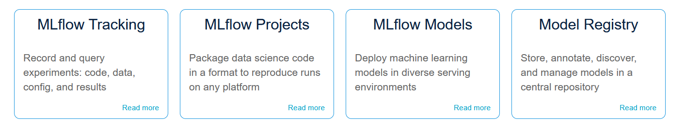

# MLflow Overview

MLflow is an open-source platform that helps manage the entire machine learning
lifecycle, including experimentation, reproducibility, deployment, and model
management. It provides four core components:

1. **MLflow Tracking**:

    Tracks experiments to log and query results such as parameters, metrics, and
    models.

2. **MLflow Projects**:

    Defines and packages code in a reusable and reproducible format for running
    machine learning workflows.

3. **MLflow Models**:

    Manages and stores machine learning models in various formats for deployment
    across different platforms.

4. **MLflow Registry**:

    A central repository for managing the lifecycle of machine learning models,
    including versioning and stage transitions.

For more information, visit the [MLflow website](https://mlflow.org/).

---
