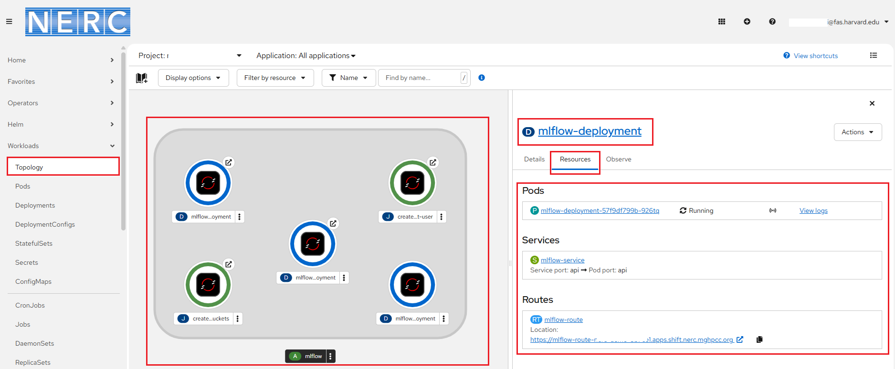
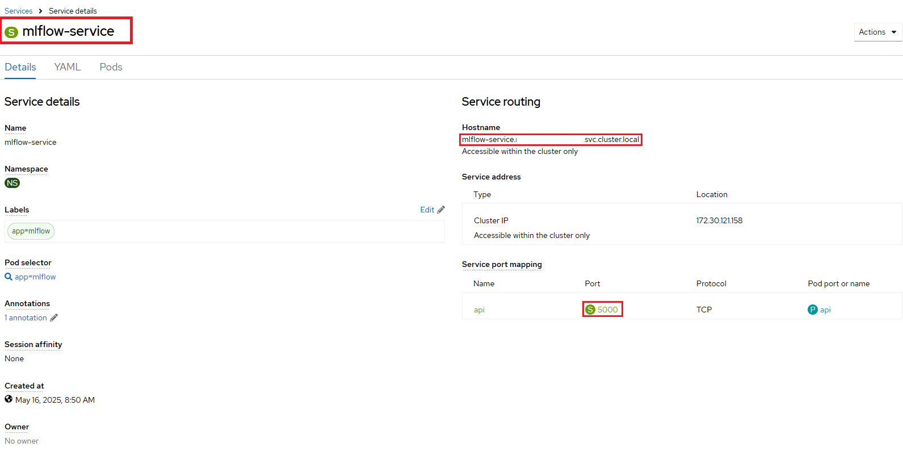
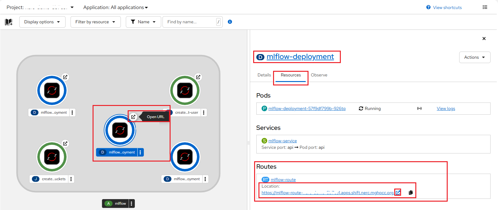
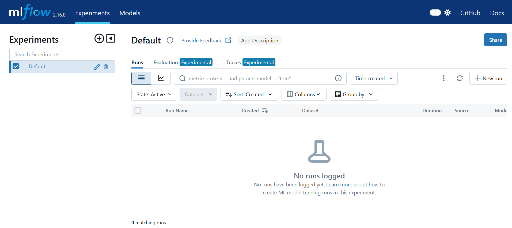
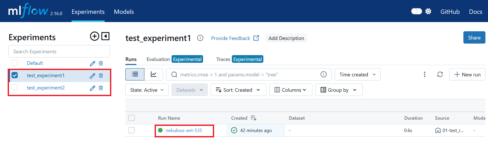
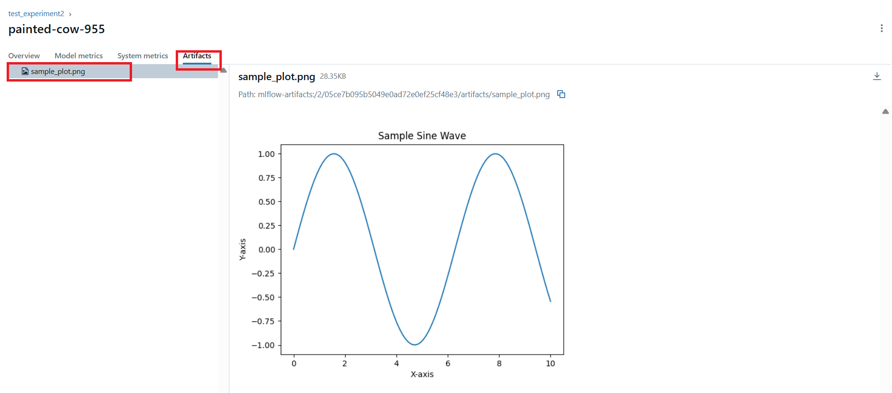

# MLflow Server Setup

Our MLflow Server Setup has a straightforward architecture, as illustrated in the
figure below:


It consists of three main components: a backend store that holds experiment metadata
(such as hyperparameters and metrics), an artifact store for storing all artifacts
(like model files), and the MLflow server, which provides an API and a UI for
viewing and recording this information.

In our setup, we are going to use:

**PostgreSQL database** - for storing MLflow metadata

**MinIO S3 Storage** - for storing the MLflow artifacts such as model training
files (such as models, data, and visualizations, etc.). These artifacts are crucial
for reproducing and understanding the results of a machine learning experiment.
To manage and store these artifacts in a scalable, durable, and secure manner, an
S3 bucket is required.

## Standalone Deployment of `MLflow` Server

-   **Prerequisites**:

    Setup the OpenShift CLI (`oc`) Tools locally and configure the OpenShift CLI
    to enable `oc` commands. Refer to [this user guide](../../openshift/logging-in/setup-the-openshift-cli.md).

### Deployment procedure

1. **Clone** or navigate to [this repository](https://github.com/nerc-project/llm-on-nerc.git).

    To get started, clone the repository using:

    ```sh
    git clone https://github.com/nerc-project/llm-on-nerc.git
    cd llm-on-nerc/mlflow
    ```

2. In the `standalone` folder, you will find the following YAML files that allow
    you to easily deploy a **MLflow** infrastructure:

    -   **01-mlflow-postgres.yml**: Defines all objects required to setup a standalone
        **PostgreSQL** database.

        This allow allow you to set your own database info via Secrets:

        -   **database-name:** vectordb  # Change this with your own value

        -   **database-password:** vectordb  # Change this with your own value

        -   **database-user:** vectordb  # Change this with your own value

    -   **02-mlflow-minio.yml**: Defines all objects required to setup a **MinIO**
        object storage instance:

        -   Deploys a MinIO instance in your project namespace.

        -   Creates one storage bucket within the MinIO instance named as `mlflow-bucket`.

        -   Generates a random **Root User**, which can also be used as the
            *Access Key*, and a **Root User Password**, which serves as the
            *Secret Key* for accessing both the MinIO API and the MinIO Console.

        -   Installs all required network policies.

    -   **03-mlflow-server.yml**: Creates a **Mlflow Server** that connects

You can run this `oc` command: `oc apply -f ./standalone/.` to execute all of the
above described YAML files located in the **standalone** folder at once.

```sh
oc apply -f ./standalone/.

secret/mlflow-postgresql-secret created
persistentvolumeclaim/mlflow-postgresql-pvc created
deployment.apps/mlflow-postgresql-deployment created
service/mlflow-postgresql-service created
serviceaccount/mlflow-minio-setup created
rolebinding.rbac.authorization.k8s.io/mlflow-minio-setup-edit created
persistentvolumeclaim/mlflow-minio-pvc created
deployment.apps/mlflow-minio-deployment created
job.batch/create-minio-buckets created
job.batch/create-mlflow-minio-root-user created
service/mlflow-minio-service created
route.route.openshift.io/mlflow-minio-console created
route.route.openshift.io/mlflow-minio-s3 created
deployment.apps/mlflow-deployment created
service/mlflow-service created
route.route.openshift.io/mlflow-route created
```

## Clean Up

To delete all resources if not necessary just run `oc delete -f ./standalone/.`.

## Usage

1. Go to the [NERC's OpenShift Web Console](https://console.apps.shift.nerc.mghpcc.org).

2. Click on the **Perspective Switcher** drop-down menu and select **Developer**.

3. In the **Navigation Menu**, click **Topology** view and make sure that you are
    on the MLflow project.

    

4. Check the `mlflow-deployment` pod circle that is in dark blue color (this means
  it has finished deploying successfully and the pod is "Running").

    The API is now accessible at the endpoints:

    -   defined by your Service, accessible internally on port **5000** using http.

        This is accessible **within the cluster only**, such as from the NERC RHOAI
        Workbench hosted Jupyter Notebooks or another pod within your project namespace.

        You can use either the service name or the fully qualified internal **Hostname**
        for service routing, as shown below:

        -   **Option 1:** Using the service name i.e. `http://mlflow-service:5000`

        -   **Option 2:** Using the full internal hostname i.e. `http://mlflow-service.<your-namespace>.svc.cluster.local:5000`

        

    -   defined by your Route, accessible externally through https, e.g. `https://mlflow-route-<your-namespace>.apps.shift.nerc.mghpcc.org`.

        **Accessing MLflow GUI Dashboard:**

        When the application has been deployed successfully, you can either open
        the application URL using the **Open URL** icon in the top right corner
        of the Pod's circle as shown below or you can naviate to the route URL
        by navigating to the "Routes" section under the _Location_ path as shown
        below:

        

        This show the MLflow GUI as shown below:

        

## Adding MLflow to Training Code

```python
import mlflow
from sklearn.linear_model import LogisticRegression

# Set the tracking URI to your remote MLflow server

# This Route endpoint is accessible externally over **HTTPS**:
mlflow.set_tracking_uri("https://mlflow-route-<your-namespace>.apps.shift.nerc.mghpcc.org")  # Replace with your own remote server's route

# Alternatively: Set the tracking URI to a local MLflow server's service endpoint. This is accessible internally over **HTTP** on the specified port.

# This option is accessible within the cluster only, such as from:
# -   NERC RHOAI Workbench (Jupyter Notebooks)
# -   Another pod within your project namespace

# You can use either the service name or the fully qualified internal Hostname:

# Option 1: Using the service name
# mlflow.set_tracking_uri("http://mlflow-service:5000")

# Option 2: Using the full internal Hostname
# mlflow.set_tracking_uri("http://mlflow-service.<your-namespace>.svc.cluster.local:5000")

# Setting the experiment
mlflow.set_experiment("my-experiment")

if __name__ == "__main__":
    # Enabling automatic logging for scikit-learn runs
    mlflow.sklearn.autolog()

    # Starting a logging run
    with mlflow.start_run():
        # train
```

## Examples

Set up your Python Virtual environment and install all required packages by running:
`pip install -r examples/requirements.txt` inside the activated virtual environment.

Then you can run the following python experiment scripts:

-   **01-test_remote.py**: Please open and edit the Python file to set the tracking
    URI to your own remote MLflow server and then run:

    ```sh
    (venv)$ python examples/01-test_remote.py
    2025/05/15 18:36:13 INFO mlflow.tracking.fluent: Experiment with name 'test_experiment1' does not exist. Creating a new experiment.
    Run logged successfully!
    🏃 View run nebulous-ant-535 at: https://mlflow-route-<your-namespace>.apps.shift.nerc.mghpcc.org/#/experiments/1/runs/55f01904bd914be880fe9fd1fdbcc515
    🧪 View experiment at: https://mlflow-route-<your-namespace>.apps.shift.nerc.mghpcc.org/#/experiments/1
    ```

-   **02-test_remote.py**: Please open and edit the Python file to set the trackin
    URI to your own remote MLflow server. Also, you need to set the MinIO S3 endpoint
    URL to your MinIO server API and the MinIO S3 credentials i.e. `AWS_ACCESS_KEY_ID`
    and `AWS_SECRET_ACCESS_KEY` and then run:

    ```sh
    (venv)$ python examples/02-test_remote.py
    https://mlflow-route-<your-namespace>.apps.shift.nerc.mghpcc.org
    2025/05/15 18:36:34 INFO mlflow.tracking.fluent: Experiment with name 'test_experiment2' does not exist. Creating a new experiment.
    Artifact sample_plot.png logged successfully!
    🏃 View run painted-cow-955 at: https://mlflow-route-<your-namespace>.apps.shift.nerc.mghpcc.org/#/experiments/2/runs/05ce7b095b5049e0ad72e0ef25cf48e3
    ```



By clicking on the **test_experiment2** run in the MLflow GUI, you can verify that
the experiment has successfully stored the artifact under the **Artifacts** tab
as shown below:



!!! info "Very Important"

    There are ways we can improve this setup - for example, by adding basic
    authentication to the MLflow GUI to ensure that only authorized users can
    access it.

For more details, refer to this [documentation](https://github.com/nerc-project/llm-on-nerc/blob/main/llm-servers/llama.cpp/README.md).

---
