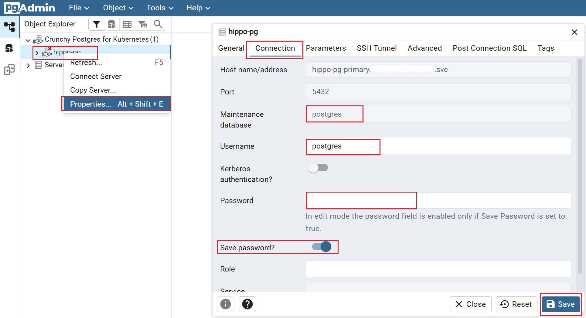

# Create a Postgres Cluster

In the NERC OpenShift environment, the [Crunchy Postgres for Kubernetes](https://www.crunchydata.com/products/crunchy-postgresql-for-kubernetes)
Operator is already installed, configured, and ready for general users to provision
and manage PostgreSQL clusters.


Built on **Postgres Operator from Crunchy Data (PGO)**, the Postgres Operator from
Crunchy Data, Crunchy Postgres for Kubernetes gives you a declarative Postgres
solution that automatically manages your PostgreSQL clusters.

## Steps

### Using the CLI (oc command) on your local Terminal

Make sure you have the `oc` CLI tool installed and configured on your local
machine following [these steps](../../openshift/logging-in/setup-the-openshift-cli.md#first-time-usage).

!!! info "Information"

    Some users may have access to multiple projects. Run the following command to
    switch to a specific project space: `oc project <your-project-namespace>`.

### Set up a PostgreSQL cluster

Run the following command in your terminal to set up a PostgreSQL cluster named
`hippo-pg`:

!!! danger "Very Important: Changing the Server Name"

    You can change the server name, e.g., `hippo-pg`, but make sure that all
    references to this name are updated in the subsequent steps.

```sh
cat <<EOF | oc apply -f -
apiVersion: postgres-operator.crunchydata.com/v1beta1
kind: PostgresCluster
metadata:
  name: hippo-pg
#   finalizers:
#     - postgres-operator.crunchydata.com/finalizer
  labels:
    app: hippo-pg
spec:
#   port: 5432
  users:
    - databases:
        - postgres
      name: postgres
      options: SUPERUSER
      password:
        type: AlphaNumeric
    - databases:
        - postgres
      name: admin
      options: SUPERUSER
      password:
        type: AlphaNumeric
#   proxy:
#     pgBouncer:
#       port: 5432
#       replicas: 3
#       service:
#         type: ClusterIP
#   monitoring:
#     pgmonitor:
#       exporter:
#         image: 'registry.developers.crunchydata.com/crunchydata/crunchy-postgres-exporter:ubi8-5.6.1-0'
#         resources:
#           limits:
#             cpu: 100m
#             memory: 128Mi
#           requests:
#             cpu: 50m
#             memory: 64Mi
#   backups:
#     pgbackrest:
#       global:
#         repo1-retention-full: '2'
#         repo1-retention-diff: '3'
#         archive-push-queue-max: 4GiB
#         repo1-retention-archive-type: 'diff'
#         repo1-retention-archive: '2'
#       repos:
#         - name: repo1
#           schedules:
#               full: "0 2 * * 0"           # Full backup every Sunday at 2 AM
#               differential: "0 2 * * 1-6" # Differential backup Mon-Sat at 2 AM
#               incremental: "0 */8 * * *"  # Incremental backup every 8 hours
#           volume:
#             volumeClaimSpec:
#               accessModes:
#                 - ReadWriteOnce
#               resources:
#                 requests:
#                   storage: 100Gi
  service:
    type: ClusterIP
  patroni:
    dynamicConfiguration:
      postgresql:
        parameters:
          max_connections: 100
          shared_buffers: 256MB
        pg_hba:
          - "host all all 0.0.0.0/0 md5"
          - "host all all ::/0 md5"
          - "local all all trust"
      synchronous_mode: false
    leaderLeaseDurationSeconds: 30
    port: 8008
    switchover:
      enabled: true
      type: Switchover
    syncPeriodSeconds: 10
  instances:
    - name: instance1
      replicas: 1
      dataVolumeClaimSpec:
        accessModes:
          - ReadWriteOnce
        resources:
          requests:
            storage: 20Gi   # Change this with your own value
            cpu: 200m
            memory: 200Mi
          limits:
            cpu: 1
            memory: 1Gi
      walVolumeClaimSpec:
        accessModes:
          - ReadWriteOnce
        resources:
          requests:
            storage: 10Gi
            cpu: 200m
            memory: 200Mi
          limits:
            cpu: 200m
            memory: 200Mi
      resources:
        requests:
          cpu: 200m
          memory: 200Mi
        limits:
          cpu: 1
          memory: 1Gi
  postgresVersion: 16
  openshift: true
EOF
```

!!! tip "PostgreSQL Cluster Configuration"

    In this setup, we are using the **basic settings** to create a PostgreSQL cluster.
    However, you can **customize your cluster** to create a **production-ready**
    environment with **backups**, **scaling**, **high availability**, **monitoring**,
    and **seamless upgrades**.

    **NOTE:** Doing so will require additional **resource quotas** to support the
    enhanced features.

    For more details, refer to the Crunchy Data documentation: [Creating a PostgreSQL Cluster – Crunchy Data](https://access.crunchydata.com/documentation/postgres-operator/latest/tutorials/basic-setup/create-cluster#what-happens-when-a-postgres-cluster-is-created).

### Background: PVC, Services and Secrets

Make sure the `pvc` are in a bound state. Run the following command:

```sh
oc get pvc --selector=postgres-operator.crunchydata.com/cluster=hippo-pg
```

The output should look similar to:

```sh
hippo-pg-instance1-wksp-pgdata                 Bound     pvc-ec32bb28-fa66-45ec-bb3b-5dd560200d2f   20Gi       RWO            ocs-external-storagecluster-ceph-rbd   <unset>                 38m
hippo-pg-instance1-wksp-pgwal                  Bound     pvc-9c26989e-ad67-4de5-b39f-e82a233e85f3   10Gi       RWO            ocs-external-storagecluster-ceph-rbd   <unset>                 38m
```

When your PostgreSQL cluster is initialized using the script above to set up the
cluster named `hippo-pg`, **PGO** creates a set of Kubernetes Services that provide
stable endpoints for connecting to your PostgreSQL databases. These endpoints
ensure a consistent and reliable way for your application to access and interact
with your data. To see which services are available, you can run the following command:

```sh
oc get svc --selector=postgres-operator.crunchydata.com/cluster=hippo-pg
```

The output should look similar to:

```sh
NAME                 TYPE        CLUSTER-IP       EXTERNAL-IP   PORT(S)    AGE
hippo-pg-ha          ClusterIP   172.30.243.135   <none>        5432/TCP   138m
hippo-pg-ha-config   ClusterIP   None             <none>        <none>     138m
hippo-pg-pods        ClusterIP   None             <none>        <none>     138m
hippo-pg-primary     ClusterIP   None             <none>        5432/TCP   138m
hippo-pg-replicas    ClusterIP   172.30.250.15    <none>        5432/TCP   138m
```

You don't need to worry about most of these Services, as they are primarily used
to manage the overall health of your PostgreSQL cluster. For connecting your application
to the database, the Service you should use is `hippo-pg-primary`.

You can query the pod using:

```sh
oc get pod -o name -l postgres-operator.crunchydata.com/cluster=hippo-pg,postgres-operator.crunchydata.com/role=master
```

The **PGO** will also bootstrap a database and create PostgreSQL users (e.g. `admin`
and `postgres`) as defined in `spec:users`. These accounts can be used by your
application to access the database i.e. `postgres`.

This information is stored in a **Secret** named with the pattern
`<clusterName>-pguser-<userName>`. For our `hippo-pg` cluster, the Secrets are
called `hippo-pg-pguser-admin` and `hippo-pg-pguser-postgres`, corresponding to
the `admin` and `postgres` users.

```sh
oc get secrets --selector=postgres-operator.crunchydata.com/cluster=hippo-pg
```

The output should look similar to:

```sh
NAME                            TYPE     DATA   AGE
hippo-pg-cluster-cert           Opaque   3      46m
hippo-pg-instance1-wksp-certs   Opaque   4      46m
hippo-pg-pguser-admin           Opaque   8      46m
hippo-pg-pguser-postgres        Opaque   8      46m
hippo-pg-replication-cert       Opaque   3      46m
```

These Secrets contain the information needed to connect your application to the
PostgreSQL database:

-   **user**: The name of the user account.

-   **password**: The password for the user account.

-   **dbname**: The default database that the user has access to.

-   **host**: The host name of the database, referencing the **Service** of the
    primary PostgreSQL Cluster instance.

-   **port**: The port on which the database is listening.

-   **uri**: A [PostgreSQL connection URI](https://www.postgresql.org/docs/current/libpq-connect.html#LIBPQ-CONNSTRING)
    containing all information for logging into the database.

-   **jdbc-uri**: A [PostgreSQL JDBC connection URI](https://jdbc.postgresql.org/documentation/use/)
    for connecting via a JDBC driver.

### Connect via `psql` in the local Terminal

If you are on the same network as your PostgreSQL cluster, you can connect directly
to it using the following command:

```sh
psql $(oc get secrets hippo-pg-pguser-postgres -o go-template='{{.data.uri | base64decode}}')
```

### Connect Using a Port-Forward

To access PostgreSQL Cluster without public exposure, you can use port forwarding
to the cluster's primary pod - on port `5432`:

```sh
PG_CLUSTER_PRIMARY_POD=$(oc get pod -o name -l postgres-operator.crunchydata.com/cluster=hippo-pg,postgres-operator.crunchydata.com/role=master)
oc port-forward "${PG_CLUSTER_PRIMARY_POD}" 5432:5432
```

You should see output similar to:

```sh
Forwarding from 127.0.0.1:5432 -> 5432
Forwarding from [::1]:5432 -> 5432
```

Run the following commands to establish a connection to the PostgreSQL cluster:

```sh
PG_CLUSTER_USER_SECRET_NAME=hippo-pg-pguser-postgres

PGUSER=$(oc get secrets "${PG_CLUSTER_USER_SECRET_NAME}" -o go-template='{{.data.user | base64decode}}') \
PGPASSWORD=$(oc get secrets "${PG_CLUSTER_USER_SECRET_NAME}" -o go-template='{{.data.password | base64decode}}') \
PGDATABASE=$(oc get secrets "${PG_CLUSTER_USER_SECRET_NAME}" -o go-template='{{.data.dbname | base64decode}}') \
psql -h localhost -p 5432
```

### Connecting With `pgAdmin`

Crunchy Postgres for Kubernetes also provides a `pgAdmin` image for users who
prefer working with a graphical user interface.

Let's create the `pgAdmin` database browser.

-   Create a secret for pgAdmin password:

    ```sh
    export PGADMIN_PASSWORD='<your-pgadmin-password>'
    ```

-   Create a secret for pgAdmin password:

    ```sh
    oc create secret generic pgadmin-password-secret \
    --from-literal=pgadmin-admin-password=$PGADMIN_PASSWORD
    ```

-   Run the below command to create pgAdmin instance

    ```sh
    cat <<EOF | oc apply -f -
    apiVersion: postgres-operator.crunchydata.com/v1beta1
    kind: PGAdmin
    metadata:
      name: hippo-pgadmin
    spec:
      dataVolumeClaimSpec:
        accessModes:
          - ReadWriteOnce
        resources:
          requests:
            storage: 1Gi
      serverGroups:
        - name: Crunchy Postgres for Kubernetes
          postgresClusterSelector: {}
      serviceName: hippo-pgadmin
      users:
        - passwordRef:
            key: pgadmin-admin-password
            name: pgadmin-password-secret
          role: Administrator
          username: admin@example.com   # Change this with your own username
    EOF
    ```

    !!! tip "To access pgAdmin without public exposure"

        To access **pgAdmin** without creating a **public Route** (as described
        in the next step), you can use port forwarding to the *pgAdmin service*
        i.e. `hippo-pgadmin` - on port `5050`:

        ```sh
        oc port-forward svc/hippo-pgadmin 5050:5050
        ```

        You should see output similar to:

        ```sh
        Forwarding from 127.0.0.1:5050 -> 5050
        Forwarding from [::1]:5050 -> 5050
        ```

        Once the port-forward is active, open your browser and navigate to:

        ```sh
        http://localhost:5050
        ```

        Use the following credentials to log in to the opened `pgAdmin` database explorer:

        **username:** admin@example.com

        **password:** $PGADMIN_PASSWORD

-   To access **pgAdmin** publicly, create a route for the `pgAdmin` database explorer:

    ```sh
    cat <<EOF | oc apply -f -
    kind: Route
    apiVersion: route.openshift.io/v1
    metadata:
      name: route-pgadmin
    spec:
      to:
        kind: Service
        name: hippo-pgadmin
        weight: 100
      port:
        targetPort: pgadmin-port
      tls:
        termination: edge
        insecureEdgeTerminationPolicy: Redirect
      wildcardPolicy: None
    EOF
    ```

-   Get the `pgAdmin` URL to access the database explorer:

    ```sh
    oc get routes route-pgadmin -o jsonpath='https://{.spec.host}'
    ```

    Browse to the retrieved `pgAdmin` URL in your web browser to access the database
    explorer.

    

    Use the following credentials to log in to the `pgAdmin` database explorer:

    **username:** <admin@example.com>

    **password:** $PGADMIN_PASSWORD

Once logged in, you can access the **pgAdmin** console as shown below:


Click the **Crunchy Postgres for Kubernetes** server group to view the existing
server, e.g., `hippo-pg`.  

To configure server connections, right-click on `hippo-pg` and select **Properties**
to open the **Server** dialog.

Use the **Server** dialog to define a connection to the server. Click the
**Connection** tab to continue.

In the **Connection** tab, configure the connection using the following fields:



-   **Maintenance database**: Specify the name of the initial database to which
    the client will connect.

-   **Username**: Specify the role name used to authenticate with the server.

-   **Password**: Enter the password used for authentication.

-   **Save password?**: Check this box to save the password for future use. Use
    **Clear Saved Password** to remove it if needed.

To retrieve these information, run the following commands:

```sh
PG_CLUSTER_USER_SECRET_NAME=hippo-pg-pguser-postgres

oc get secrets "${PG_CLUSTER_USER_SECRET_NAME}" -o go-template='{{.data.dbname | base64decode}}'
oc get secrets "${PG_CLUSTER_USER_SECRET_NAME}" -o go-template='{{.data.user | base64decode}}'
oc get secrets "${PG_CLUSTER_USER_SECRET_NAME}" -o go-template='{{.data.password | base64decode}}'
```

These commands extract the **database name**, **username**, and **password** from
the Kubernetes Secret associated with the specified user in your PostgreSQL cluster.

!!! tip "Admin User Secret"

    For the `admin` user, set the Secret name as follows:

    ```sh
    PG_CLUSTER_USER_SECRET_NAME=hippo-pg-pguser-admin
    ```

    To retrieve this information for the `admin` user, run the following commands:

    ```sh
    oc get secret "${PG_CLUSTER_USER_SECRET_NAME}" -o go-template='{{.data.dbname | base64decode}}'
    oc get secret "${PG_CLUSTER_USER_SECRET_NAME}" -o go-template='{{.data.user | base64decode}}'
    oc get secret "${PG_CLUSTER_USER_SECRET_NAME}" -o go-template='{{.data.password | base64decode}}'
    ```

Once the database connection is successful, you will see the `pgAdmin` console as
shown below:


### Deleting the `pgAdmin`

If `pgAdmin` was created as a *PGAdmin* custom resource, you can delete it by running:

```sh
oc delete pgadmin hippo-pgadmin
```

If `pgAdmin` was exposed with a *Route*, you can also delete the route:

```sh
oc delete route route-pgadmin
```

### Delete the Postgres Cluster

There comes a time when it is necessary to delete your Postgres Cluster. If you
have been following along with the example, you can delete your cluster by simply
running:

```sh
oc delete postgrescluster hippo-pg
```

This removes the *PostgresCluster* resource and all associated components managed
by the PGO.

---
